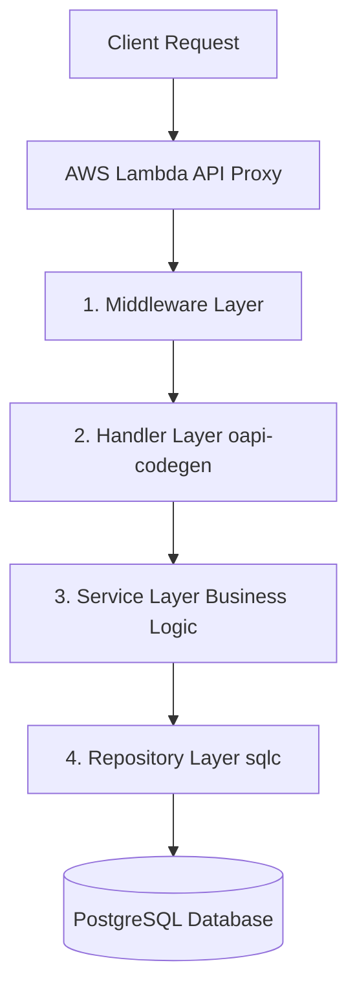

# Eventer Map 백엔드 아키텍처 (Backend Architecture)

이 문서는 Eventer Map 백엔드 시스템의 전체 구조와 데이터 흐름, 그리고 각 계층(Layer)의 역할을 설명합니다.

## 🏗 전체 구조 개요 (Layered Architecture)

본 백엔드는 관심사 분리(Separation of Concerns)를 극대화하기 위해 4단계 계층형 아키텍처를 채택했습니다. 모든 데이터와 의존성은 단방향(Handler ➔ Service ➔ Repository)으로만 흐릅니다.

---

## 📂 디렉토리 구조 및 역할

백엔드의 주요 비즈니스 로직은 외부에서 접근할 수 없도록 `internal/` 폴더 내부에 격리되어 있습니다.

### 1. `cmd/server/` (진입점 & 와이어링)
- `main.go`가 위치하는 곳으로, 애플리케이션의 시작점입니다.
- **의존성 주입(DI)**: DB를 연결하고, Repository ➔ Service ➔ Handler 순서로 객체를 생성한 뒤 하나로 조립합니다.
- **라우터 연결**: `oapi-codegen`으로 자동 생성된 라우팅 규칙을 서버에 등록하고 미들웨어를 씌워 AWS Lambda 어댑터로 실행합니다.

### 2. `internal/middleware/` (공통 처리 계층)
- **역할**: 모든 HTTP 요청이 비즈니스 로직에 도달하기 전/후에 공통으로 처리해야 할 작업을 담당합니다.
- **예시**: 
  - `logger.go`: 요청 경로와 소요 시간 로깅
  - `auth.go` (예정): JWT 토큰 파싱 및 유저 정보 검증
  - `cors.go` (예정): 브라우저 보안 헤더 세팅

### 3. `internal/handler/` (표현 계층)
- **역할**: 클라이언트의 HTTP 요청을 해석하고, 응답(JSON)을 내려주는 계층입니다. 비즈니스 로직은 절대 포함하지 않습니다.
- **oapi-codegen 활용**: OpenAPI 명세(`api/openapi.yaml`)를 기반으로 파라미터 파싱 및 데이터 타입(Struct) 자동 생성 코드가 `openapi.gen.go`에 존재합니다.
- **검증 규칙**: 이메일 포맷, 좌표 범위 등 특정 API에 종속적인 파라미터 검증 로직은 이 계층에서 수행합니다.

### 4. `internal/service/` (비즈니스 계층)
- **역할**: 서비스의 핵심 비즈니스 로직(예: "유저가 이벤트를 찜하면 포인트 지급", "중복 신고 체크" 등)이 들어가는 심장부입니다.
- **독립성**: 이 계층은 HTTP(Request/Response) 객체에 대해 전혀 모릅니다. 오직 순수한 Go 타입 데이터만 주고받아 유닛 테스트가 매우 쉽습니다.
- **구조**: 도메인별(User, Event, Artist, Venue)로 `xxxService` 구조체가 존재합니다.

### 5. `internal/repository/` (데이터 계층)
- **역할**: 데이터베이스와 직접 소통하며 쿼리를 실행하는 계층입니다.
- **sqlc 활용**: 개발자가 작성한 `db/query/*.sql` 파일을 읽어 `sqlc`가 자동으로 Go 함수를 생성했습니다. (예: `q.CreateUser()`)
- **보안**: 100% Prepared Statement를 사용하여 SQL 인젝션 공격을 원천 차단합니다.

---

## 🔄 데이터 흐름 예시 (Request Flow)

클라이언트가 특정 아티스트 정보를 요청했을 때의 흐름입니다.

1. **Lambda Proxy**: API Gateway를 통해 들어온 HTTP 요청을 Go 표준 `http.Request`로 변환합니다.
2. **Middleware**: Logger가 요청 시간을 기록하기 시작합니다.
3. **Handler (`GetArtist`)**: `oapi-codegen`이 URL 경로에서 `artist_id`를 파싱하여 문자열로 빼냅니다.
4. **Service (`GetArtistInfo`)**: 핸들러에게 ID를 넘겨받아 해당 아티스트가 삭제된 상태인지 등 비즈니스 규칙을 확인합니다.
5. **Repository (`GetArtist`)**: DB에 SELECT 쿼리를 날려 데이터를 가져와 Service로 반환합니다.
6. **Handler**: 최종 데이터를 JSON으로 예쁘게 포장하여 응답합니다.
7. **Middleware**: 응답이 나갈 때 걸린 총 시간을 출력합니다.
