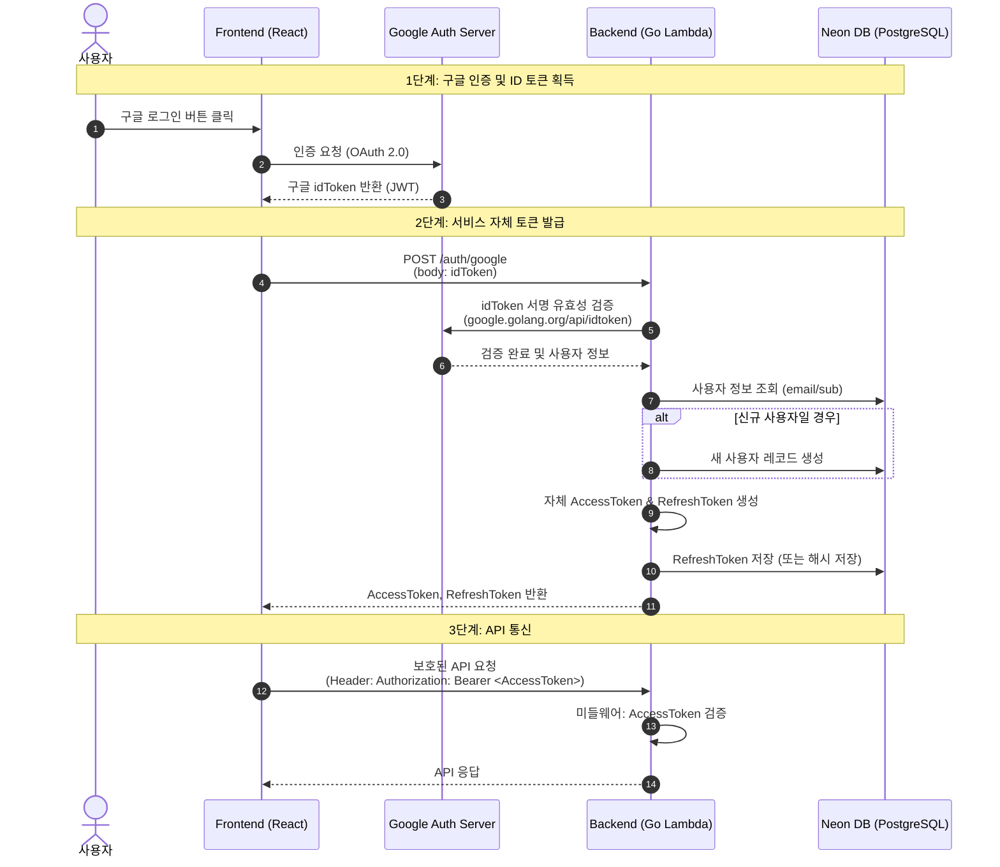

# 구글 로그인 플로우 및 설계도

프론트엔드(React)와 서버리스 백엔드(AWS Lambda, Go 표준 라이브러리) 환경에서의 최적화된 구글 인증(OAuth 2.0 / OIDC) 흐름입니다.

## 📌 인증 방식 설계
- **프론트엔드 (React):** `@react-oauth/google` 라이브러리를 사용하여 구글로부터 직접 `idToken`(자격 증명)을 발급받습니다.
- **백엔드 (Go Lambda):** 프론트엔드가 전달한 `idToken`을 구글 서버 키로 검증한 뒤, 우리 서비스 전용의 커스텀 JWT(`Access Token`, `Refresh Token`)를 발급하여 클라이언트의 통제권을 갖습니다.

---

## 🗺️ 시퀀스 다이어그램 (Sequence Diagram)



---

## 🛠️ 백엔드(Go) 구현 핵심 포인트

**1. ID 토큰 검증 패키지**
Go 표준 라이브러리를 지향하더라도, 구글 토큰 검증은 보안상 매우 중요하므로 구글에서 공식 제공하는 `google.golang.org/api/idtoken` 패키지 사용을 권장합니다.

**2. 자체 JWT 토큰 설계**
- `Access Token`: 수명이 짧은 토큰 (예: 1시간). 매 API 요청 시 검증.
- `Refresh Token`: 수명이 긴 토큰 (예: 14일). `Access Token` 만료 시 갱신을 위해 사용. DB에 저장하여 언제든 강제 로그아웃(토큰 무효화) 처리 가능.

**3. 표준 라이브러리(`net/http`) 기반 미들웨어**
보호된 엔드포인트(예: 프로필 조회, 마커 생성 등)에 접근할 때 토큰을 검사할 수 있도록, Go의 표준 `http.Handler`를 감싸는 미들웨어(Middleware) 패턴을 작성해야 합니다.

```go
// 미들웨어 예시 뼈대
func AuthMiddleware(next http.Handler) http.Handler {
    return http.HandlerFunc(func(w http.ResponseWriter, r *http.Request) {
        // 1. Authorization 헤더 파싱
        // 2. JWT 서명 검증 및 만료 시간 확인
        // 3. context.WithValue를 이용해 파싱된 유저 정보를 Request Context에 담아 전달
        next.ServeHTTP(w, r)
    })
}
```
