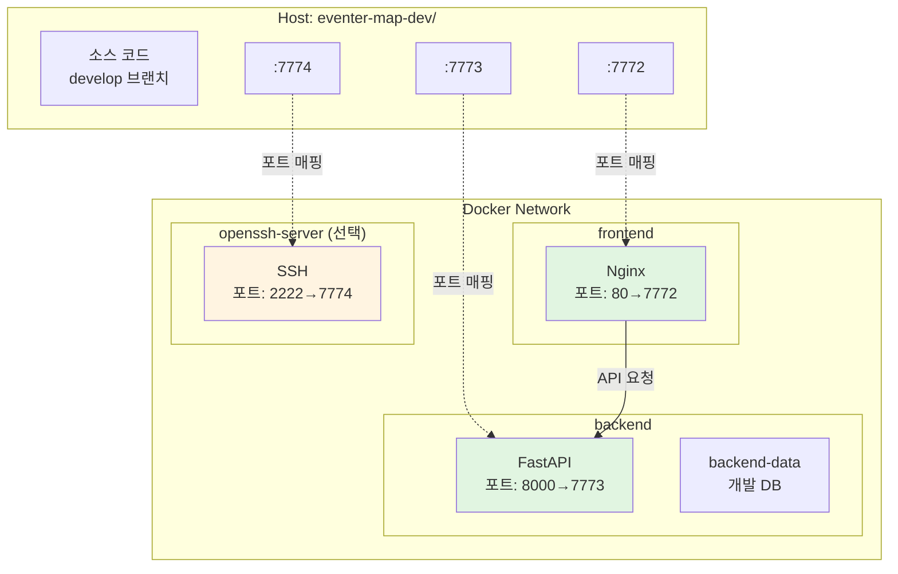
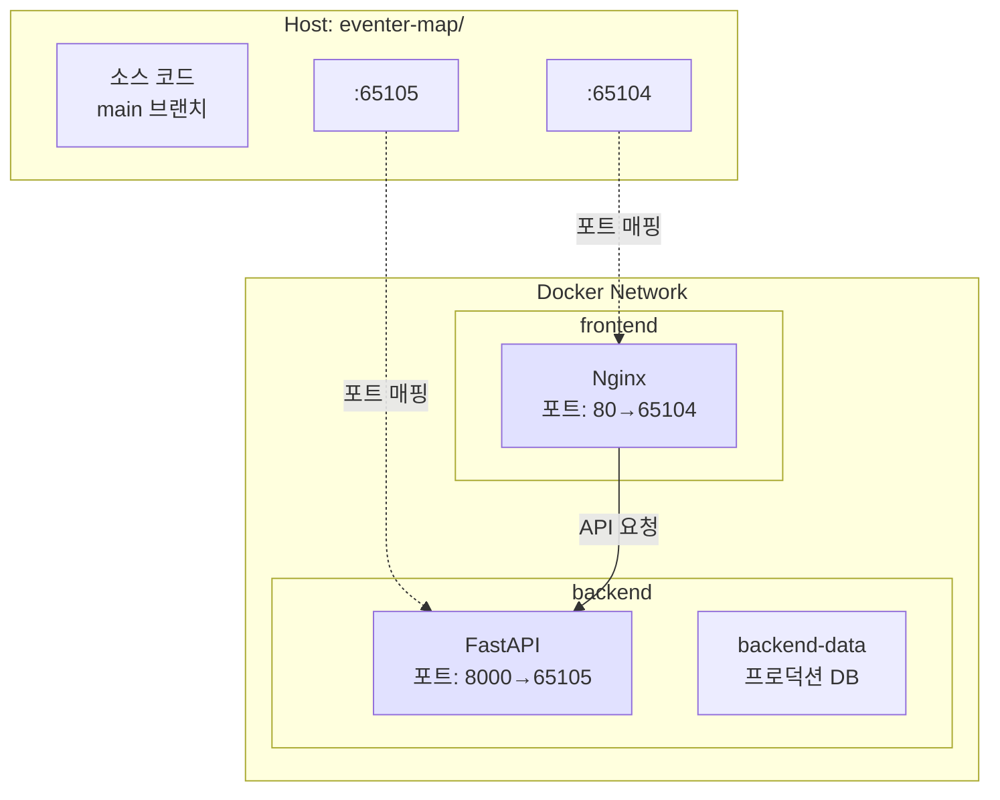

# Docker 환경 설정 가이드

## 📋 개요

이 프로젝트는 **두 개의 별도 디렉토리**로 개발/배포 환경을 분리합니다.

```
nas/
├── eventer-map-dev/    # 개발 환경 (develop 브랜치)
└── eventer-map/        # 배포 환경 (main 브랜치)
```

---

## 🚀 빠른 시작

### 1단계: 디렉토리 설정

```bash
# NAS 또는 서버에서
cd /path/to/projects

# 배포용 (main 브랜치)
git clone https://github.com/your-repo/eventer-map.git
cd eventer-map
git checkout main

# 개발용 (develop 브랜치)
cd ..
git clone https://github.com/your-repo/eventer-map.git eventer-map-dev
cd eventer-map-dev
git checkout develop
```

### 2단계: 환경 변수 설정

**개발 환경** (`eventer-map-dev/.env`):
```bash
cp .env.example .env
# .env 파일 편집
BACKEND_PORT=7773
FRONTEND_PORT=7772
SSH_PORT=7774
REACT_APP_API_URL=http://localhost:7773
CORS_ORIGINS=http://localhost:7772,http://localhost
REACT_APP_GOOGLE_MAPS_API_KEY=your_key_here
```

**배포 환경** (`eventer-map/.env`):
```bash
cp .env.example .env
# .env 파일 편집
BACKEND_PORT=65105
FRONTEND_PORT=65104
REACT_APP_API_URL=http://192.168.1.100:65105  # 실제 NAS IP
CORS_ORIGINS=http://192.168.1.100:65104,http://192.168.1.100
REACT_APP_GOOGLE_MAPS_API_KEY=your_key_here
```

### 3단계: 실행

**개발 환경:**
```bash
cd /path/to/eventer-map-dev
docker-compose up -d

# SSH 접속도 필요한 경우
docker-compose --profile ssh up -d

# 접속: http://localhost:7772
```

**배포 환경:**
```bash
cd /path/to/eventer-map
docker-compose up -d

# 접속: http://192.168.1.100:65104 (또는 NAS IP)
```

---

## 📊 환경 구조

### 개발 환경 (eventer-map-dev/)



### 배포 환경 (eventer-map/)



---

## 🔧 주요 명령어

### 실행/중지

```bash
# 실행
docker-compose up -d

# 로그 확인
docker-compose logs -f

# 중지
docker-compose down

# 완전 삭제 (데이터베이스 포함)
docker-compose down -v
```

### 업데이트

**개발 환경:**
```bash
cd eventer-map-dev
git pull origin develop
docker-compose down
docker-compose up -d --build
# ssh 접속도 필요한 경우
docker-compose --profile ssh build
docker-compose --profile ssh up -d
```

**배포 환경:**
```bash
cd eventer-map
git pull origin main
docker-compose down
docker-compose up -d --build
```

---

## 💡 주요 차이점

| 항목 | 개발 환경 | 배포 환경 |
|------|----------|----------|
| **디렉토리** | `eventer-map-dev/` | `eventer-map/` |
| **Git 브랜치** | `develop` | `main` |
| **포트** | Frontend: 7772<br/>Backend: 7773 | Frontend: 65104<br/>Backend: 65105 |
| **SSH** | 가능 (7774, 선택사항) | 없음 |
| **데이터베이스** | 독립적인 `backend-data` 볼륨 | 독립적인 `backend-data` 볼륨 |
| **동시 실행** | ✅ 가능 (포트 충돌 없음) | ✅ 가능 |

---

## 🎯 워크플로우

### 개발 → 배포 프로세스

```bash
# 1. 개발 환경에서 작업
cd eventer-map-dev
git checkout develop
# ... 코딩 ...
git add .
git commit -m "새 기능 추가"
git push origin develop

# 2. 테스트 확인
docker-compose restart

# 3. 배포 준비
git checkout main
git merge develop
git push origin main

# 4. 배포 환경 업데이트
cd ../eventer-map
git pull origin main
docker-compose down
docker-compose up -d --build
```

---

## ❓ FAQ

### Q: 왜 두 개의 디렉토리를 사용하나요?

**A:** 간단하고 안전합니다!
- ✅ 개발 중 실수로 배포 코드 수정 방지
- ✅ 각 환경이 완전히 독립적
- ✅ 복잡한 docker-compose 오버라이드 불필요
- ✅ Git 브랜치도 명확히 분리

### Q: 디스크 공간이 2배 필요한가요?

**A:** 네, 하지만 장점이 더 큽니다.
- 소스 코드는 작음 (몇 MB)
- Docker 이미지는 공유됨
- 데이터베이스만 분리됨

### Q: SSH는 언제 필요한가요?

**A:** 원격에서 개발할 때만 사용합니다.
```bash
# SSH 포함 실행
docker-compose --profile ssh up -d

# SSH 접속
ssh developer@nas-ip -p 7774
```
# 1. 처음 시작 (이미지 빌드 + 컨테이너 시작)
docker-compose -f docker-compose.dev.yml up -d

# 2. Dockerfile 수정 시 (재빌드 필요)
docker-compose -f docker-compose.dev.yml up -d --build

# 3. 코드만 수정 (개발 모드에서는 자동 반영, 재시작 불필요!)
# 아무것도 안 해도 됨

# 4. .env 수정 시 (재시작만)
docker-compose -f docker-compose.dev.yml restart

# 5. 완전히 새로 시작
docker-compose -f docker-compose.dev.yml down
docker-compose -f docker-compose.dev.yml up -d --build

### Q: 한 디렉토리에서 할 수 없나요?

**A:** 가능하지만 복잡하고 위험합니다.
- 개발 코드 수정 → 배포 컨테이너도 영향
- 데이터베이스 공유 → 테스트 데이터 오염
- docker-compose -f 옵션으로 전환 → 실수 가능성

---

## 🔒 보안 체크리스트

배포 전 확인사항:

- [ ] `.env` 파일에 실제 Google Maps API 키 입력
- [ ] `CORS_ORIGINS`를 실제 NAS IP로 변경
- [ ] Google Maps API 키에 HTTP 리퍼러 제한 설정
- [ ] NAS 방화벽에서 필요한 포트 개방
- [ ] SSH는 개발 환경에서만 사용
- [ ] 배포 환경에는 `.env` 파일 보안 확인

---

## 📚 관련 문서

- [배포 가이드](./SYNOLOGY_DEPLOYMENT.md)
- [환경 변수 설정](./ENVIRONMENT_VARIABLES.md)
- [트러블슈팅](./TROUBLESHOOTING.md)
