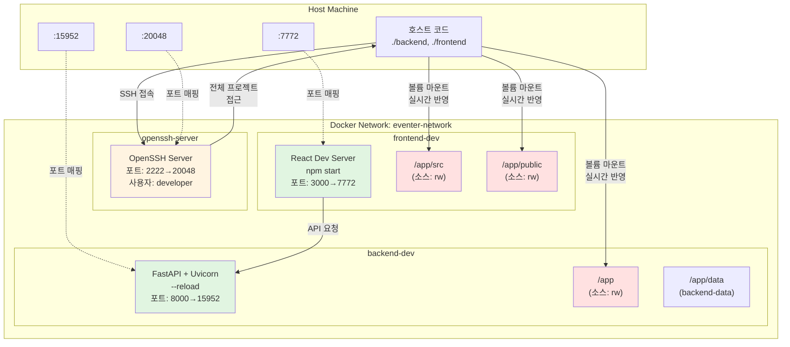
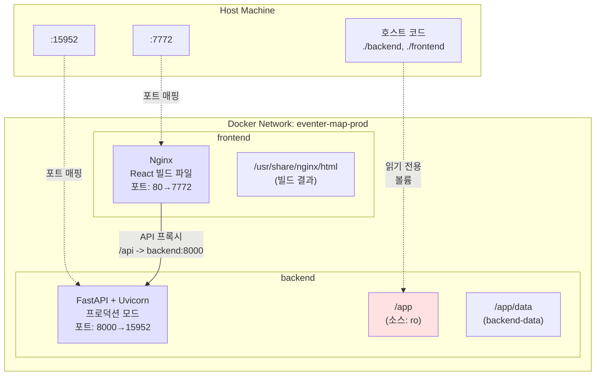
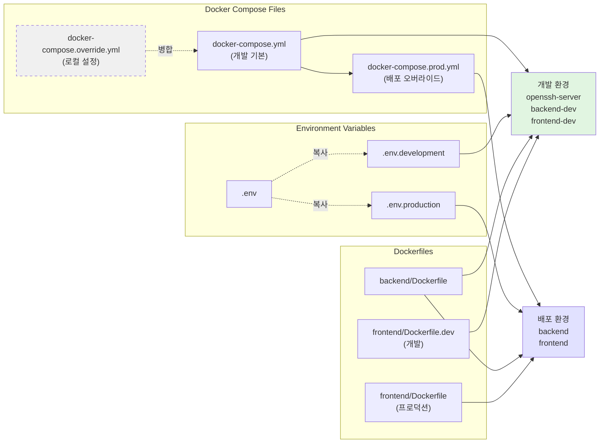

# Docker 환경 설정 가이드

## 개요

이 프로젝트는 개발 환경과 배포 환경을 분리하여 관리합니다.

- **개발 환경**: 소스 코드 hot-reload, 디버깅 도구, SSH 접속 지원
- **배포 환경**: 읽기 전용 볼륨, 프로덕션 최적화, 별도 네트워크

---

## 환경 구조 다이어그램

### 개발 환경 (Development)



### 배포 환경 (Production)



### 파일 구조 및 서비스 관계



## 파일 구조

```
eventer-map/
├── docker-compose.yml                  # 개발 환경 (기본)
├── docker-compose.prod.yml             # 배포 환경 오버라이드
├── docker-compose.override.yml.example # 로컬 설정 예제
├── docker-compose.yml.backup           # 원본 백업
├── .env.development                    # 개발 환경 변수 예제
├── .env.production                     # 배포 환경 변수
├── backend/
│   ├── Dockerfile                      # 배포용
│   └── .dockerignore
└── frontend/
    ├── Dockerfile                      # 배포용 (nginx)
    ├── Dockerfile.dev                  # 개발용 (npm start)
    └── .dockerignore
```

## 사용법

### 개발 환경

```bash
# 1. 환경 변수 설정 (최초 1회)
cp .env.development .env
# .env 파일을 열어 REACT_APP_GOOGLE_MAPS_API_KEY 등 필요한 값 입력

# 2. 개발 환경 시작
docker-compose up -d

# 3. 로그 확인
docker-compose logs -f backend-dev
docker-compose logs -f frontend-dev

# 4. SSH 접속 (선택사항)
ssh developer@localhost -p 20048

# 5. 중지
docker-compose down
```

**개발 환경 서비스:**
- `openssh-server`: SSH 접속 (포트 20048)
- `backend-dev`: FastAPI 개발 서버 (포트 15952, hot-reload)
- `frontend-dev`: React 개발 서버 (포트 7772, hot-reload)

**특징:**
- ✅ 코드 변경 시 자동 재시작 (backend: uvicorn --reload, frontend: npm start)
- ✅ 소스 코드 볼륨 마운트 (`./backend:/app:rw`, `./frontend/src:/app/src:rw`)
- ✅ SSH를 통한 원격 개발 가능

---

### 배포 환경

```bash
# 1. 환경 변수 설정
cp .env.production .env
# .env 파일에서 배포용 설정 확인/수정

# 2. 배포 환경 시작
docker-compose -f docker-compose.yml -f docker-compose.prod.yml up -d

# 3. 로그 확인
docker-compose -f docker-compose.yml -f docker-compose.prod.yml logs -f backend
docker-compose -f docker-compose.yml -f docker-compose.prod.yml logs -f frontend

# 4. 중지
docker-compose -f docker-compose.yml -f docker-compose.prod.yml down
```

**배포 환경 서비스:**
- `backend`: FastAPI 프로덕션 서버 (포트 15952)
- `frontend`: nginx + React 빌드 (포트 7772)

**특징:**
- ✅ 읽기 전용 볼륨 (보안 강화)
- ✅ 프로덕션 최적화 (빌드된 파일 제공)
- ✅ 별도 네트워크 (`eventer-map-prod`)
- ✅ OpenSSH 서버 미포함 (보안)

---

### 로컬 개발자 설정 (선택사항)

개발자마다 다른 설정이 필요한 경우:

```bash
# 1. 로컬 오버라이드 파일 생성
cp docker-compose.override.yml.example docker-compose.override.yml

# 2. docker-compose.override.yml 편집
# - SSH 공개키 추가
# - 개발자별 환경 변수 추가

# 3. Docker Compose가 자동으로 적용 (명시적 지정 불필요)
docker-compose up -d
```

> **참고**: `docker-compose.override.yml`은 `.gitignore`에 포함되어 있어 Git에 커밋되지 않습니다.

---

## 주요 차이점

| 항목 | 개발 환경 | 배포 환경 |
|------|----------|----------|
| **서비스 이름** | `backend-dev`, `frontend-dev` | `backend`, `frontend` |
| **포트** | Backend: 15952, Frontend: 7772 | Backend: 15952, Frontend: 7772 |
| **볼륨 마운트** | 읽기/쓰기 (`:rw`) | 읽기 전용 (`:ro`) |
| **Hot-reload** | ✅ 활성화 | ❌ 비활성화 |
| **SSH 접속** | ✅ 가능 (포트 20048) | ❌ 불가 |
| **네트워크** | `eventer-network` | `eventer-map-prod` |
| **Frontend 서버** | npm start (개발 서버) | nginx (프로덕션) |
| **Backend 실행** | `uvicorn --reload` | `uvicorn` (일반) |

---

## 문제 해결

### 포트 충돌

```bash
# 다른 포트 사용하려면 .env 파일 수정
BACKEND_PORT=8001
FRONTEND_PORT=3001
```

### SSH 접속 안됨

```bash
# 1. SSH 서비스 상태 확인
docker-compose ps openssh-server

# 2. 로그 확인
docker-compose logs openssh-server

# 3. docker-compose.override.yml에 공개키 추가 (권장)
# 또는 비밀번호 접속 활성화 (개발용)
```

### 코드 변경이 반영 안됨

```bash
# 개발 환경인지 확인
docker-compose ps  # backend-dev, frontend-dev인지 확인

# 컨테이너 재시작
docker-compose restart backend-dev
docker-compose restart frontend-dev
```

### 배포 환경에서 소스 수정이 안됨

이것은 의도된 동작입니다. 배포 환경은 읽기 전용(`:ro`)으로 마운트되어 있습니다.

---

## 추가 정보

### Git 브랜치 전략

```bash
# 개발
git checkout develop
docker-compose up -d

# 배포
git checkout main
git merge develop
docker-compose -f docker-compose.yml -f docker-compose.prod.yml up -d
```

### 데이터 백업

```bash
# SQLite 데이터베이스는 Docker 볼륨에 저장됨
docker volume ls | grep backend-data

# 백업
docker run --rm -v eventer-map_backend-data:/data -v $(pwd):/backup \
  alpine tar czf /backup/backend-data-backup.tar.gz /data
```

### 컨테이너 내부 접속

```bash
# Backend
docker exec -it eventer-map-backend-dev /bin/sh

# Frontend  
docker exec -it eventer-map-frontend-dev /bin/sh
```

---

## 변경 사항 요약

1. ✅ 개발/배포 환경 완전 분리
2. ✅ OpenSSH Server 추가 (개발 환경)
3. ✅ 소스 코드 hot-reload 지원 (개발 환경)
4. ✅ 읽기 전용 볼륨 (배포 환경)
5. ✅ `.dockerignore` 파일 추가 (빌드 최적화)
6. ✅ `.env.development` 템플릿 추가
7. ✅ 원본 백업 (`docker-compose.yml.backup`)
