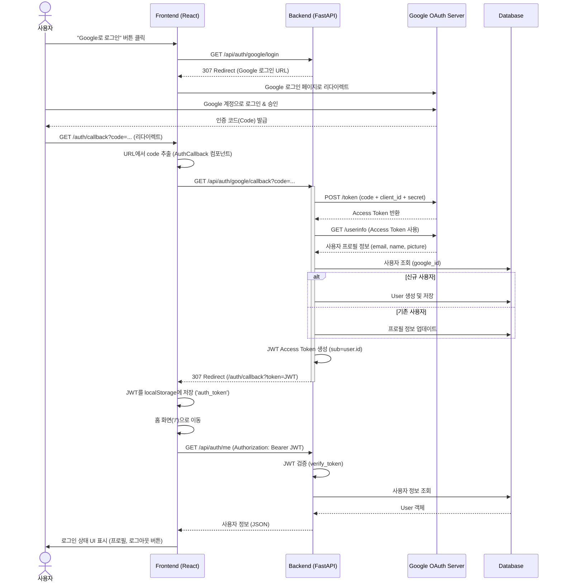

# Google OAuth 로그인 시퀀스

이 문서는 Eventer Map 애플리케이션의 Google OAuth 2.0 로그인 프로세스를 설명합니다.

## 주요 구성 요소

### Frontend
- **LoginButton**: `/api/auth/google/login`으로 리다이렉트 시작
- **AuthCallback**: `/auth/callback` 라우트에서 처리, URL 파라미터의 `token`을 추출하여 저장
- **AuthContext**: `localStorage`에 토큰 관리 및 전역 인증 상태(`user`, `isAuthenticated`) 제공
- **Interceptor**: 모든 API 요청에 자동으로 `Authorization: Bearer <token>` 헤더 추가

### Backend
- **Login Endpoint**: Google OAuth URL 생성 및 리다이렉트
- **Callback Endpoint**: 
  1. `httpx`를 사용하여 Google과 통신 (Code -> Token -> UserInfo)
  2. DB에 사용자 정보 동기화 (Create or Update)
  3. 자체 JWT 발급 (HS256)
- **Token Verification**: `python-jose`를 사용하여 JWT 서명 및 만료 검증
- **Security**: `@require_auth` 데코레이터로 API 보호
