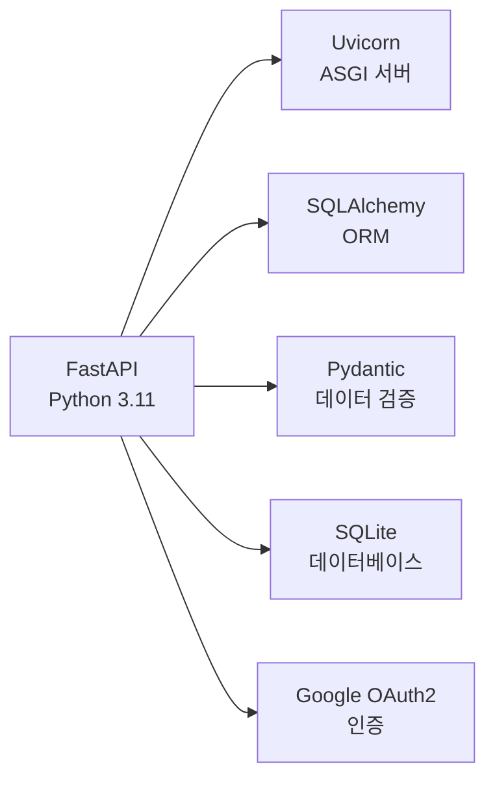
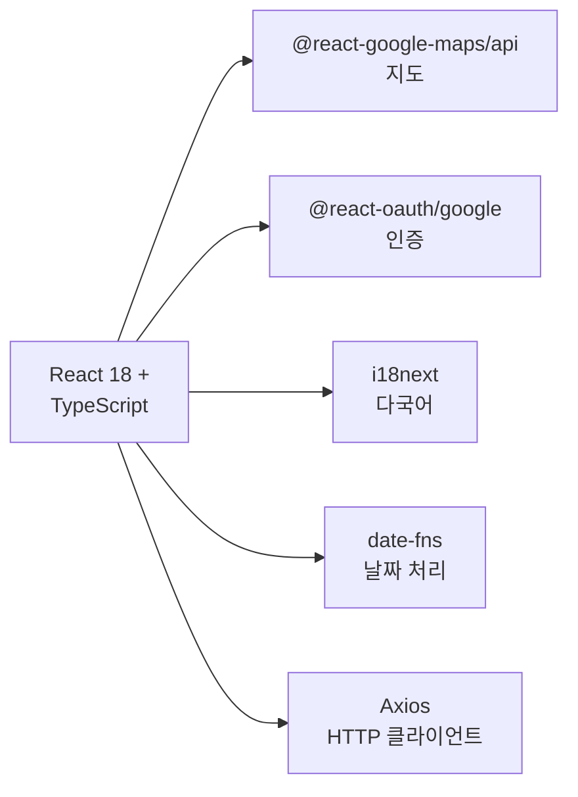
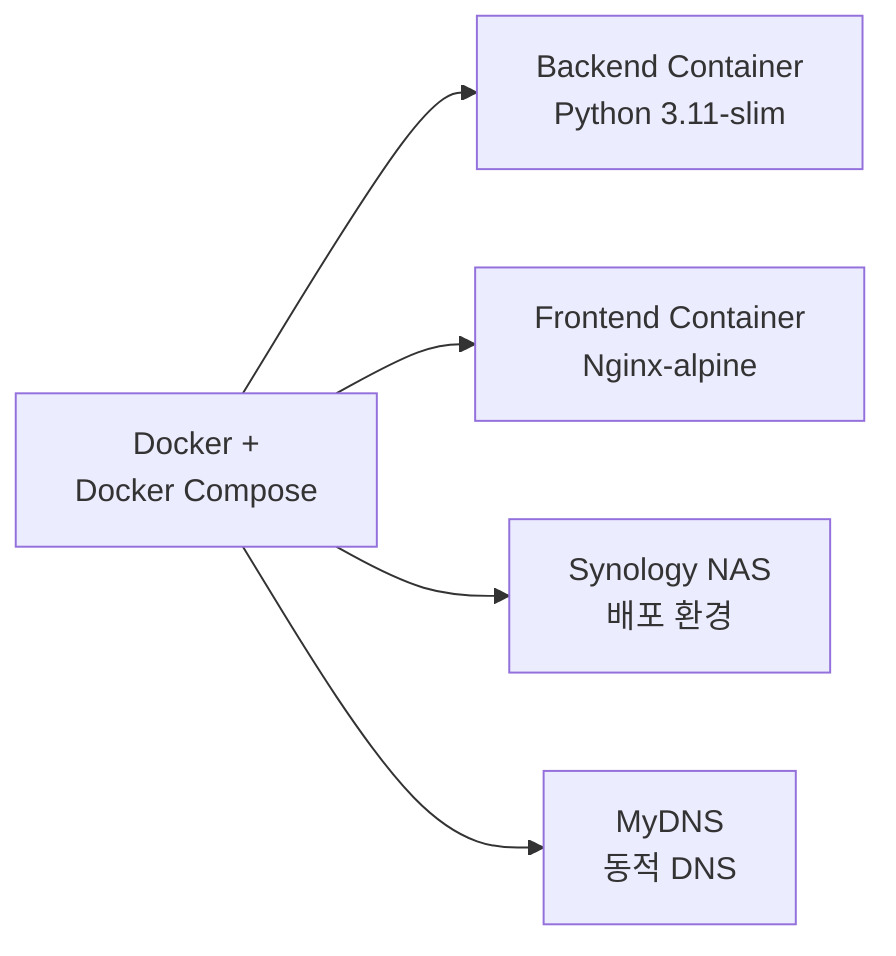
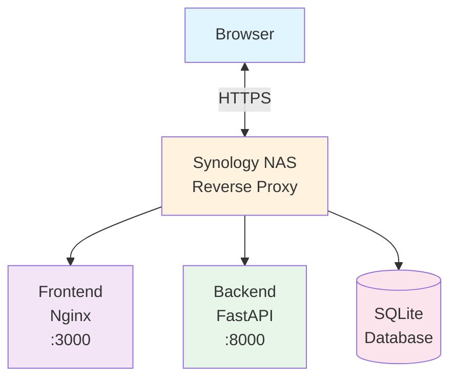
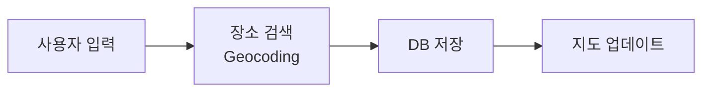
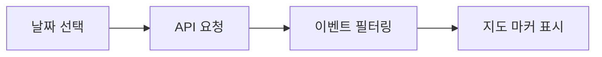
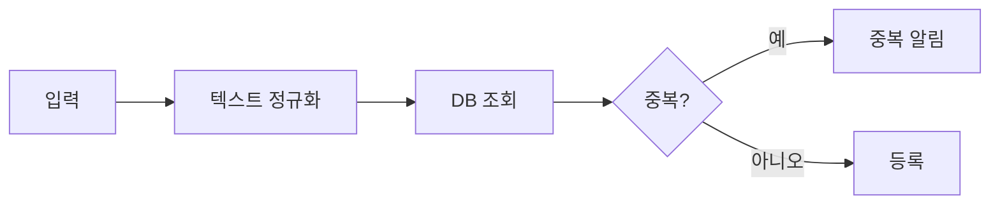
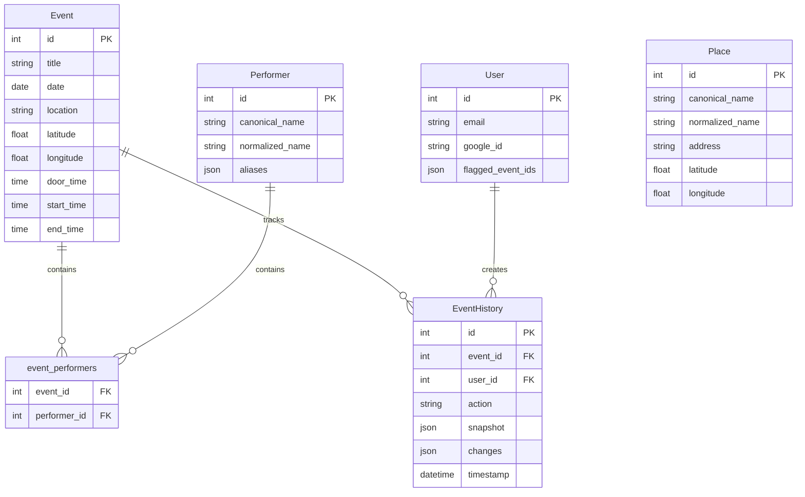

# Eventer Map - 포트폴리오

> 📍 **이벤트 정보를 지도에 시각화하는 풀스택 웹 애플리케이션**  
> 🗓️ **개발 기간**: 2025년 11월 ~ 12월 (약 2개월)  
> 🚀 **배포**: Synology NAS + Docker  
> 🔗 **URL**: https://eventermap.mydns.jp

---

## 📋 프로젝트 개요

### 목적
이벤트 정보(공연, 전시회 등)를 시간과 장소 기반으로 관리하고, Google Maps를 통해 시각적으로 표시하는 웹 애플리케이션입니다. 사용자는 날짜별로 이벤트를 조회하고, 지도에서 위치를 확인하며, 출연자별로 필터링할 수 있습니다.

### 주요 특징
- 📅 **날짜 기반 이벤트 관리**: 특정 날짜의 모든 이벤트를 한눈에 확인
- 🗺️ **지도 시각화**: Google Maps API를 활용한 이벤트 위치 표시
- 🎭 **출연자 관리**: 중복 방지 시스템과 별칭 지원
- 🔐 **Google OAuth 인증**: 소셜 로그인 및 사용자별 기능 제공
- 🌐 **다국어 지원**: 한국어/영어/일본어 (i18next)
- 🎨 **다크/라이트 모드**: 테마 전환 기능

---

## 🛠️ 기술 스택

### Backend

### Frontend

### Infrastructure

---

## 🏗️ 시스템 아키텍처

### 전체 구조

### 주요 데이터 흐름

#### 1. 이벤트 등록

#### 2. 날짜별 조회

#### 3. 중복 검사

---

## ✨ 주요 기능

### 1. 이벤트 관리 (CRUD)
- **등록**: 제목, 날짜, 시간(개장/개연/종연), 장소, 출연자, 설명 등 상세 정보 입력
- **수정/삭제**: 작성자만 수정 가능, 이력 추적 시스템
- **조회**: 날짜별/출연자별 필터링
- **임시 저장**: LocalStorage를 활용한 입력 데이터 보존

### 2. 장소 검색 및 캐싱
- Google Geocoding API 연동으로 장소명 → 좌표 자동 변환
- 검색 결과를 DB에 캐싱하여 API 호출 최소화 (비용 절감)
- 장소별 이벤트 재사용 지원

### 3. 출연자 중복 방지 시스템
**문제**: 사용자가 "아이브", "IVE", "ive" 등 다양한 표기로 입력하여 중복 생성

**해결**:
- 텍스트 정규화 (Unicode NFKC, 소문자 변환, 특수문자 제거)
- `canonical_name` (표시용) + `normalized_name` (중복 검사용) 분리
- 별칭(aliases) 시스템으로 다양한 표기 지원
- 실시간 중복 체크 모달로 사용자에게 알림

### 4. Google Maps 통합
- **커스텀 마커**: SVG 아이콘으로 이벤트 위치 표시
- **InfoWindow**: 이벤트 상세 정보 표 형식으로 표시
- **딥링크**: 장소 클릭 시 Google Maps 앱으로 바로 이동
- **자동 중심**: 이벤트 평균 위치로 지도 중심 설정

### 5. 인증 및 권한 관리
- Google OAuth 2.0 소셜 로그인
- JWT 기반 세션 관리
- 이벤트 작성자만 수정/삭제 가능
- 관리자 기능 (이벤트 숨김, 신고 관리)

### 6. 이벤트 플래그 및 이력
- **플래그**: 관심 이벤트 북마크 기능
- **이력 추적**: 이벤트 생성/수정/삭제 기록 저장
- **신고 시스템**: 부적절한 이벤트 신고 및 관리

### 7. UI/UX
- **반응형 디자인**: 모바일/태블릿/데스크톱 지원
- **다크/라이트 모드**: 사용자 선호도 저장
- **다국어**: 한국어, 영어, 일본어 지원
- **직관적 인터페이스**: Glassmorphism 디자인 시스템

---

## 💾 데이터베이스 설계

### ERD

### 주요 테이블
- **events**: 이벤트 기본 정보 + 위치 + 시간 필드
- **performers**: 출연자 (정규화 시스템 적용)
- **places**: 장소 캐시 (Geocoding 결과 저장)
- **users**: Google OAuth 사용자 정보
- **event_histories**: 이벤트 변경 이력
- **event_reports**: 신고 내역

---

## 🎯 주요 기술적 도전과 해결

### 1. API 비용 최적화
**문제**: Google Maps API 사용 비용 우려

**해결**:
- Geocoding 결과를 DB에 캐싱하여 중복 호출 방지
- LoadScript를 앱 최상단에서 한 번만 로드
- 정적 마커 사용으로 동적 업데이트 최소화
- API 키에 도메인/Referrer 제한 설정
- **결과**: 월 사용량을 무료 할당량 내로 유지

### 2. 중복 데이터 문제
**문제**: 사용자가 다양한 표기로 입력하여 출연자/장소 중복 생성

**해결**:
- Unicode 정규화 + 대소문자 통일 + 특수문자 제거
- `normalized_name`으로 중복 체크, `canonical_name`으로 표시
- 등록 시 실시간 중복 체크 모달 표시
- 별칭 시스템으로 다양한 표기 지원

### 3. 시간 정보 표시
**문제**: 이벤트 시간이 단일 필드로 표현력 부족

**해결**:
- `door_time`(개장), `start_time`(개연), `end_time`(종연) 3개 필드로 분리
- 마이그레이션 스크립트로 기존 데이터 자동 변환
- UI에서 선택적 입력 가능 (개장 시간 없으면 skip)

### 4. 외부 접속 문제 (Synology NAS)
**문제**: 내부 네트워크에서만 접속 가능, 외부에서 접속 불가

**해결**:
- MyDNS로 동적 IP 자동 업데이트
- Synology Reverse Proxy로 도메인 라우팅
- SSL 인증서 적용 (Let's Encrypt)
- SNI(Server Name Indication) 설정으로 다중 도메인 지원

### 5. 다국어 처리
**문제**: 하드코딩된 한국어 텍스트가 많아 유지보수 어려움

**해결**:
- i18next 도입하여 번역 키 기반 시스템 구축
- JSON 파일로 언어별 번역 관리
- Context API로 전역 언어 상태 관리

---

## 🎨 UI/UX 디자인

### 디자인 시스템
- **컬러 팔레트**: CSS 변수로 테마별 색상 관리
  - Primary: 보라색 그라데이션
  - 다크/라이트 모드별 배경, 텍스트, 강조 색상 정의
- **타이포그래피**: 시스템 폰트 스택 사용
- **Glassmorphism**: 반투명 배경 + 흐림 효과

### 주요 컴포넌트
- **EventForm**: 모달 오버레이, 섹션별 그룹화
- **EventMap**: 커스텀 SVG 마커, 표 형식 InfoWindow
- **DatePicker**: 직관적인 날짜 선택 UI
- **MultiSelect**: 태그 형식 출연자 선택
- **TimeInput**: 24시간 형식 시간 입력 (시/분 분리)

---

## 🚀 배포 및 인프라

### 개발 환경
- **WSL 2 (Windows Subsystem for Linux)**: 로컬 개발
- **Docker Compose (개발용)**: OpenSSH 컨테이너 포함
- **VSCode Remote-SSH**: 컨테이너 내부 개발

### 프로덕션 환경
- **Synology NAS DS920+**: Docker 기반 배포
- **Docker Compose (프로덕션용)**: 최적화된 이미지
- **Nginx**: 정적 파일 서빙 + API 프록시
- **Reverse Proxy**: Synology DSM 내장 기능 활용
- **SSL**: Let's Encrypt 자동 갱신

### CI/CD
- 현재: 수동 배포 (git pull + docker-compose up)
- 향후: GitHub Actions 자동 배포 계획

### 백업 시스템
- SQLite DB 자동 백업 (일일)
- Docker Volume 백업
- 복원 스크립트 준비

---

## 📈 성과 및 개선사항

### 개발 효율성
✅ **체계적 문서화**: 모든 기술 결정과 개발 과정을 문서로 기록하여 컨텍스트 유지  
✅ **점진적 개선**: MVP → 기능 추가 → 안정화 순서로 진행  
✅ **마이그레이션 스크립트**: DB 스키마 변경을 안전하게 자동화  

### 기술적 성과
✅ **Google Maps API 비용 제로**: 캐싱 최적화로 무료 할당량 내 사용  
✅ **중복 데이터 90% 감소**: 정규화 시스템 도입 후 효과  
✅ **외부 접속 성공**: Synology NAS 환경에서 안정적 배포  
✅ **다국어 지원**: 3개 언어 완벽 지원  

### 사용자 경험
✅ **직관적 UI**: 첫 사용자도 설명 없이 사용 가능  
✅ **빠른 응답**: 평균 API 응답 시간 < 100ms  
✅ **모바일 최적화**: 반응형 디자인으로 모든 기기 지원  

---

## 🔮 향후 계획

### 단기 (1개월 내)
- [ ] 실제 이벤트 데이터 축적 (100개 이상)
- [ ] 사용자 피드백 수집 및 UX 개선
- [ ] 성능 모니터링 및 최적화

### 중기 (3개월 내)
- [ ] 이미지 업로드 기능 (이벤트 포스터)
- [ ] 캘린더 뷰 추가
- [ ] 고급 검색 기능 (제목, 장소, 출연자 복합 검색)
- [ ] PWA 변환 (오프라인 지원)

### 장기
- [ ] PostgreSQL 마이그레이션
- [ ] Redis 캐싱 레이어
- [ ] CI/CD 파이프라인 구축
- [ ] 테스트 코드 작성 (Jest, pytest)
- [ ] SNS 공유 기능
- [ ] 사용자 리뷰/평점 시스템

---

## 📚 참고 자료

### 프로젝트 문서
- [프로젝트 개요](docs/PROJECT_OVERVIEW.md)
- [현재 상태](docs/CURRENT_STATUS.md)
- [개발 일지](docs/logs/)
- [기술 결정 문서](docs/decisions/)

### 기술 스택 공식 문서
- [FastAPI](https://fastapi.tiangolo.com/)
- [React](https://react.dev/)
- [Google Maps API](https://developers.google.com/maps)
- [SQLAlchemy](https://www.sqlalchemy.org/)

---

## 👨‍💻 개발자 정보

**프로젝트 기간**: 2025년 11월 ~ 12월  
**개발 환경**: WSL + Docker + VSCode  
**배포 환경**: Synology NAS + Docker Compose  

---

## 📄 라이선스

MIT License
