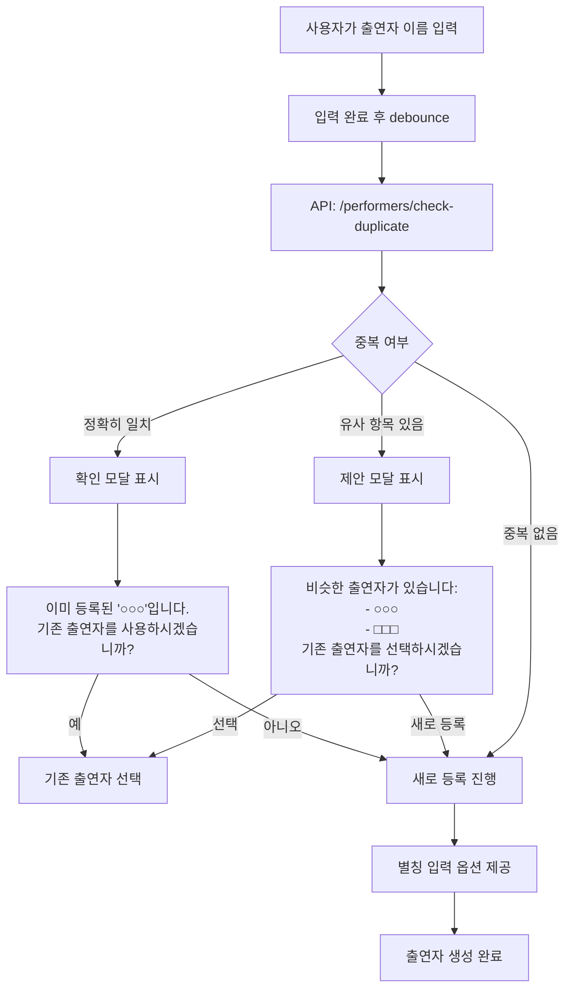

# 출연자/장소 중복 방지 전략

> 📅 **작성일**: 2025-11-26  
> 🎯 **목적**: 일본어 다중 표기로 인한 중복 데이터 방지  
> 📝 **상태**: 설계 단계  

---

## 문제 상황

### 중복 발생 원인

일본어와 영어의 다양한 표기 방식으로 인해 동일한 출연자/장소가 중복 등록됩니다.

#### 출연자 중복 예시
```
동일 아티스트의 다양한 표기:
1. "Perfume" (영어)
2. "パフューム" (가타카나)
3. "ぱふゅーむ" (히라가나)
4. "PERFUME" (대문자)
5. "Perfume " (공백 포함)
6. "Ｐｅｒｆｕｍｅ" (전각 영문)
```

#### 장소 중복 예시
```
동일 장소의 다양한 표기:
1. "Zepp Tokyo"
2. "ゼップ東京"
3. "ZEPP TOKYO"
4. "Zepp 東京"
5. "ゼップ　東京" (전각 공백)
```

### 현재 시스템의 한계

```python
# models.py - 현재 구조
class Performer(Base):
    name = Column(String, unique=True, index=True)
    # 문제: 정확히 일치하는 이름만 중복 체크
    # "Perfume"과 "パフューム"은 다른 데이터로 인식
```

---

## 선택한 해결 방안

### 방안 1 + 방안 4: 정규화 시스템 + 사용자 확인 UI

**핵심 전략**:
1. **백엔드**: 텍스트 정규화 + 별칭 시스템으로 자동 중복 감지
2. **프론트엔드**: 유사 항목 제안으로 사용자 최종 확인

---

## 기술 결정

### 1. 텍스트 정규화 (Normalization)

#### 정규화 규칙

```python
import unicodedata
import re

def normalize_text(text: str) -> str:
    """
    다양한 표기를 하나의 표준 형태로 변환
    
    예시:
    - "Zepp Tokyo" → "zepptokyo"
    - "ゼップ東京" → "ぜっぷ東京"
    - "ZEPP  TOKYO" → "zepptokyo"
    """
    if not text:
        return ""
    
    # 1. 유니코드 정규화 (NFKC)
    #    - 전각 → 반각 변환
    #    - 호환성 문자 통일
    text = unicodedata.normalize('NFKC', text)
    
    # 2. 소문자 변환 (영문)
    text = text.lower()
    
    # 3. 공백 제거
    text = re.sub(r'\s+', '', text)
    
    # 4. 특수문자 제거
    text = re.sub(r'[.\-_,・]', '', text)
    
    return text
```

#### 정규화 예시

| 원본 | 정규화 결과 | 비고 |
|------|------------|------|
| `"Zepp Tokyo"` | `"zepptokyo"` | 영문 소문자, 공백 제거 |
| `"ZEPP TOKYO"` | `"zepptokyo"` | 동일 결과 ✅ |
| `"Zepp　Tokyo"` | `"zepptokyo"` | 전각 공백도 제거 ✅ |
| `"Ｚｅｐｐ Ｔｏｋｙｏ"` | `"zepptokyo"` | 전각→반각 변환 ✅ |
| `"パフューム"` | `"ぱふゅーむ"` | 가타→히라 변환 (일부만) |

> [!NOTE]
> **한계**: 일본어-영어 매핑은 정규화로 해결 불가  
> 예: `"Perfume"` ≠ `"パフューム"` → 별칭 시스템으로 해결

---

### 2. 데이터베이스 스키마 설계

#### Performer (출연자)

```python
class Performer(Base):
    __tablename__ = "performers"
    
    id = Column(Integer, primary_key=True, index=True)
    
    # 표시용 이름 (사용자가 선택한 우선 표기)
    canonical_name = Column(String, nullable=False)
    
    # 정규화된 이름 (중복 체크용)
    normalized_name = Column(String, unique=True, index=True, nullable=False)
    
    # 다국어 이름 (선택)
    name_ja = Column(String)  # 일본어명
    name_en = Column(String)  # 영어명
    name_ko = Column(String)  # 한국어명 (선택)
    
    # 별칭 리스트 (JSON)
    aliases = Column(JSON, default=list)
    # 예: ["Perfume", "パフューム", "PERFUME"]
    
    created_at = Column(DateTime(timezone=True), server_default=func.now())
    updated_at = Column(DateTime(timezone=True), onupdate=func.now())
    
    # 관계
    events = relationship("Event", secondary=event_performers, back_populates="performers_rel")
```

#### Place (장소)

```python
class Place(Base):
    __tablename__ = "places"
    
    id = Column(Integer, primary_key=True, index=True)
    
    # 표시용 이름
    canonical_name = Column(String, nullable=False)
    
    # 정규화된 이름 (중복 체크용)
    normalized_name = Column(String, unique=True, index=True, nullable=False)
    
    # 주소
    address = Column(String)
    
    # 좌표
    latitude = Column(Float)
    longitude = Column(Float)
    
    # 별칭
    aliases = Column(JSON, default=list)
    
    created_at = Column(DateTime(timezone=True), server_default=func.now())
```

#### 스키마 변경 이유

| 필드 | 목적 | 예시 |
|------|------|------|
| `canonical_name` | UI에 표시할 공식 이름 | "Perfume" |
| `normalized_name` | 중복 체크 및 검색 | "perfume" |
| `name_ja`, `name_en` | 다국어 지원 | "パフューム", "Perfume" |
| `aliases` | 별칭/다른 표기 저장 | `["ぱふゅーむ", "PERFUME"]` |

---

### 3. API 설계

#### 중복 체크 API

```python
@router.post("/performers/check-duplicate")
def check_duplicate_performer(
    name: str,
    db: Session = Depends(get_db)
):
    """
    출연자 등록 전 중복 체크
    
    Returns:
    - exact_match: 정확히 일치하는 출연자
    - similar_matches: 유사한 출연자 목록 (정규화 기준)
    """
    normalized = normalize_text(name)
    
    # 1. 정규화된 이름으로 정확 매칭
    exact = db.query(Performer).filter(
        Performer.normalized_name == normalized
    ).first()
    
    if exact:
        return {
            "status": "duplicate",
            "exact_match": exact,
            "similar_matches": []
        }
    
    # 2. 별칭에서 검색
    similar = db.query(Performer).filter(
        Performer.aliases.contains([name])
    ).all()
    
    if similar:
        return {
            "status": "similar_found",
            "exact_match": None,
            "similar_matches": similar
        }
    
    return {
        "status": "no_duplicate",
        "exact_match": None,
        "similar_matches": []
    }
```

#### 출연자 생성 API (개선)

```python
@router.post("/performers/", response_model=PerformerResponse)
def create_performer(
    performer: PerformerCreate,
    db: Session = Depends(get_db)
):
    """
    새 출연자 생성 (중복 체크 포함)
    """
    normalized = normalize_text(performer.canonical_name)
    
    # 중복 체크
    existing = db.query(Performer).filter(
        Performer.normalized_name == normalized
    ).first()
    
    if existing:
        raise HTTPException(
            status_code=409,
            detail={
                "message": "이미 존재하는 출연자입니다",
                "existing_performer": existing
            }
        )
    
    # 새 출연자 생성
    new_performer = Performer(
        canonical_name=performer.canonical_name,
        normalized_name=normalized,
        name_ja=performer.name_ja,
        name_en=performer.name_en,
        aliases=performer.aliases or []
    )
    
    db.add(new_performer)
    db.commit()
    db.refresh(new_performer)
    
    return new_performer
```

#### 검색 API (개선)

```python
@router.get("/performers/search")
def search_performers(
    query: str,
    db: Session = Depends(get_db)
):
    """
    출연자 검색 (정규화 + 별칭 포함)
    """
    normalized_query = normalize_text(query)
    
    # 1. 정규화된 이름으로 검색
    by_normalized = db.query(Performer).filter(
        Performer.normalized_name.contains(normalized_query)
    ).all()
    
    # 2. 별칭으로 검색
    by_alias = db.query(Performer).filter(
        Performer.aliases.contains([query])
    ).all()
    
    # 3. canonical_name으로 검색 (부분 일치)
    by_canonical = db.query(Performer).filter(
        Performer.canonical_name.ilike(f"%{query}%")
    ).all()
    
    # 중복 제거 및 병합
    results = list({p.id: p for p in (by_normalized + by_alias + by_canonical)}.values())
    
    return results
```

---

### 4. 프론트엔드 UI/UX 플로우

#### 출연자 입력 시 플로우



#### React 컴포넌트 구조

```typescript
// MultiSelect.tsx에 추가
const [duplicateCheck, setDuplicateCheck] = useState<{
  status: 'duplicate' | 'similar_found' | 'no_duplicate';
  exact_match?: Performer;
  similar_matches?: Performer[];
}>();

const handlePerformerInput = async (inputValue: string) => {
  // Debounce 후 중복 체크
  const result = await api.checkDuplicatePerformer(inputValue);
  setDuplicateCheck(result);
  
  if (result.status === 'duplicate') {
    // 정확히 일치하는 경우
    showDuplicateModal({
      message: `이미 등록된 "${result.exact_match.canonical_name}"입니다.`,
      existingPerformer: result.exact_match,
      onUseExisting: () => {
        selectPerformer(result.exact_match);
      },
      onCreateNew: () => {
        proceedWithNewPerformer(inputValue);
      }
    });
  } else if (result.status === 'similar_found') {
    // 유사한 항목 있는 경우
    showSimilarModal({
      message: "비슷한 출연자가 있습니다:",
      similar: result.similar_matches,
      onSelect: (performer) => {
        selectPerformer(performer);
      },
      onCreateNew: () => {
        proceedWithNewPerformer(inputValue);
      }
    });
  }
};
```

---

## 구현 단계

### Phase 1: 정규화 시스템 (필수) ⭐

**목표**: 자동 중복 감지

**작업**:
1. ✅ 정규화 함수 구현 (`utils/normalization.py`)
2. ✅ DB 스키마 변경 (마이그레이션)
   - `normalized_name` 컬럼 추가 (Performer, Place)
   - Unique constraint 추가
3. ✅ API 수정
   - 생성 시 정규화 적용
   - 중복 체크 강화
4. ✅ 기존 데이터 마이그레이션
   - 모든 기존 데이터에 `normalized_name` 생성

**예상 소요 시간**: 2-3시간

---

### Phase 2: 별칭 시스템 (권장) ⭐⭐

**목표**: 다양한 표기 지원

**작업**:
1. ✅ DB 스키마 확장
   - `aliases` JSON 컬럼 추가
   - `name_ja`, `name_en` 컬럼 추가
2. ✅ API 확장
   - 별칭 포함 검색
   - 별칭 추가/수정 엔드포인트
3. ✅ 프론트엔드 UI
   - 별칭 입력 필드 추가
   - 등록 시 다국어 이름 입력 옵션

**예상 소요 시간**: 3-4시간

---

### Phase 3: 사용자 확인 UI (UX 개선) ⭐⭐⭐

**목표**: 사용자 최종 확인으로 정확도 100%

**작업**:
1. ✅ 중복 체크 API 구현
2. ✅ 프론트엔드 모달 컴포넌트
   - DuplicateModal (정확히 일치)
   - SimilarModal (유사 항목 제안)
3. ✅ 실시간 중복 체크
   - Debounce 적용
   - 입력 중 자동 체크

**예상 소요 시간**: 4-5시간

---

## 검증 계획

### 단위 테스트

```python
# test_normalization.py
def test_normalize_text():
    assert normalize_text("Zepp Tokyo") == "zepptokyo"
    assert normalize_text("ZEPP TOKYO") == "zepptokyo"
    assert normalize_text("Ｚｅｐｐ　Ｔｏｋｙｏ") == "zepptokyo"
    
def test_duplicate_detection():
    # "Perfume"과 "PERFUME"은 중복으로 감지되어야 함
    performer1 = create_performer("Perfume")
    with pytest.raises(HTTPException):
        create_performer("PERFUME")
```

### 통합 테스트

1. **같은 출연자를 다양한 표기로 등록 시도**
   - "Perfume", "PERFUME", "perfume " → 중복 감지 ✅

2. **별칭으로 검색**
   - "パフューム" 검색 → "Perfume" 결과 ✅

3. **UI 플로우 테스트**
   - 중복 모달 표시 확인
   - 기존 선택/새로 등록 동작 확인

---

## 성능 고려사항

### 데이터베이스 인덱스

```sql
-- 정규화된 이름에 인덱스 (필수)
CREATE UNIQUE INDEX idx_performers_normalized_name ON performers(normalized_name);
CREATE UNIQUE INDEX idx_places_normalized_name ON places(normalized_name);

-- 별칭 검색 최적화 (PostgreSQL의 경우)
CREATE INDEX idx_performers_aliases ON performers USING GIN (aliases);
```

### 캐싱 전략

```python
from functools import lru_cache

@lru_cache(maxsize=1000)
def normalize_text_cached(text: str) -> str:
    """정규화 결과 캐싱 (성능 향상)"""
    return normalize_text(text)
```

---

## 향후 확장 가능성

1. **자동 병합 제안** (관리자 기능)
   - 중복된 데이터 찾아서 병합 제안

2. **외부 DB 연동**
   - MusicBrainz API로 아티스트 정보 확인
   - Wikidata로 공식 별칭 가져오기

3. **AI 기반 유사도 판정**
   - 임베딩 벡터로 의미적 유사도 계산

---

## 참고 자료

- [Unicode Normalization](https://unicode.org/reports/tr15/)
- [Python unicodedata](https://docs.python.org/3/library/unicodedata.html)
- [SQLAlchemy JSON 타입](https://docs.sqlalchemy.org/en/14/core/type_basics.html#sqlalchemy.types.JSON)
