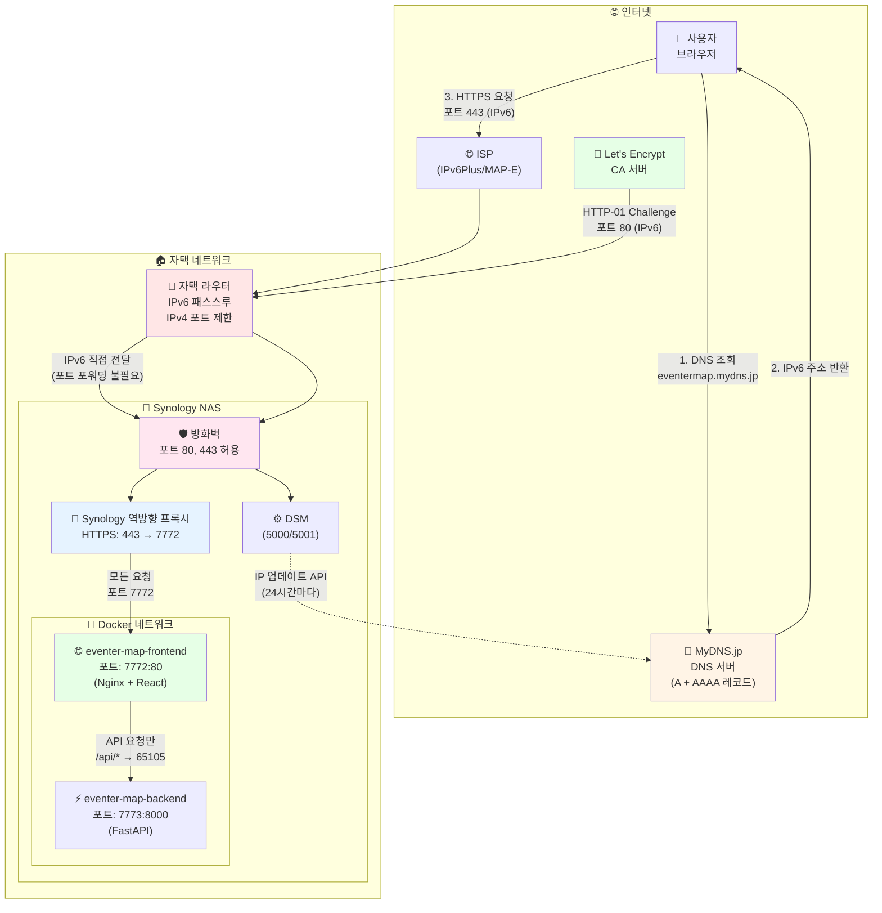
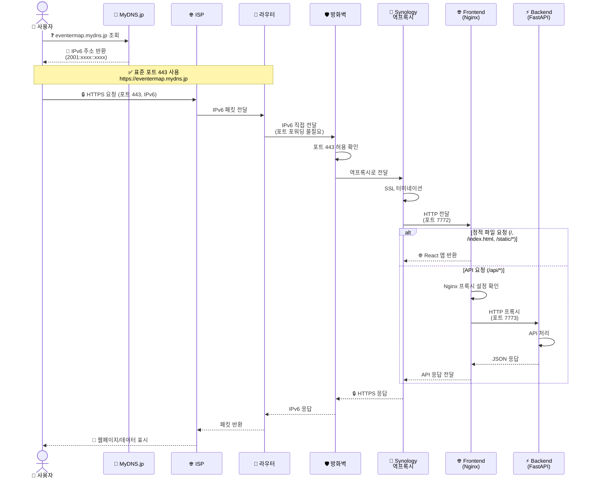
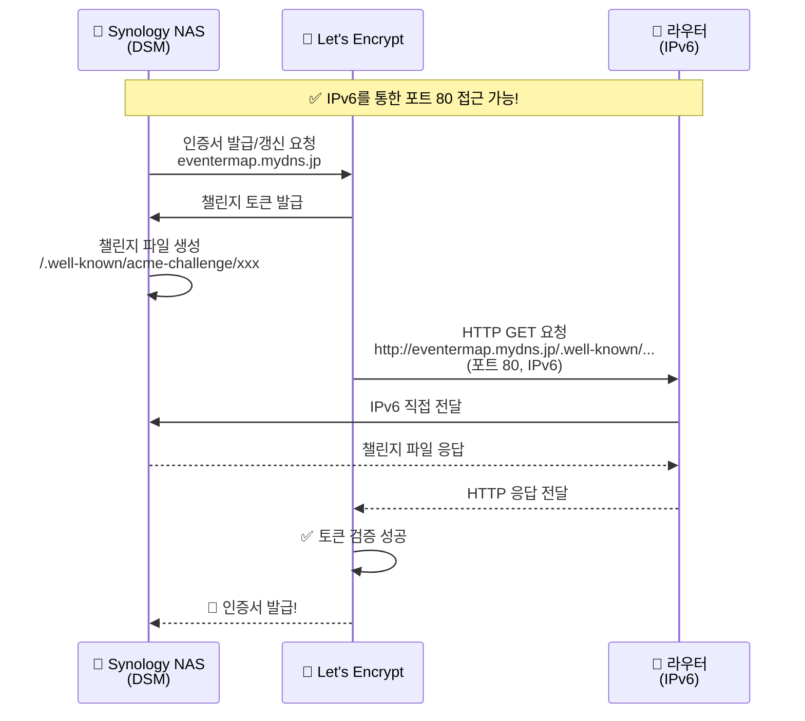
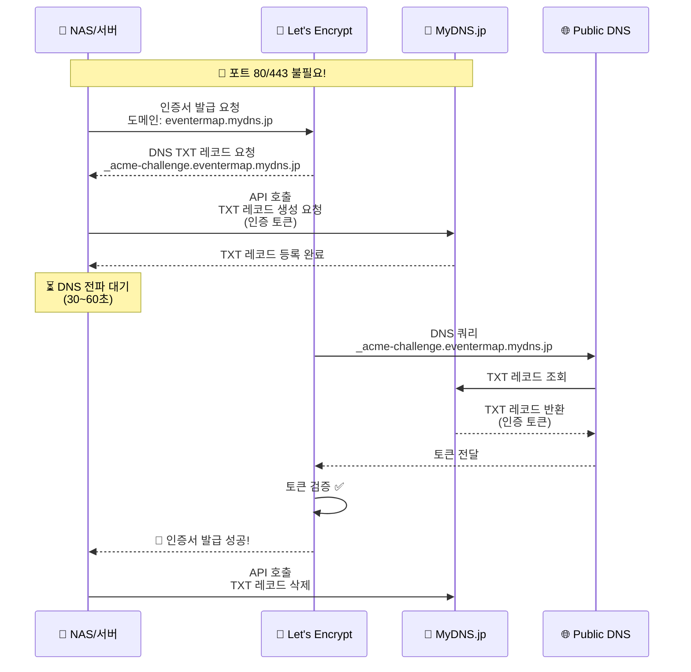
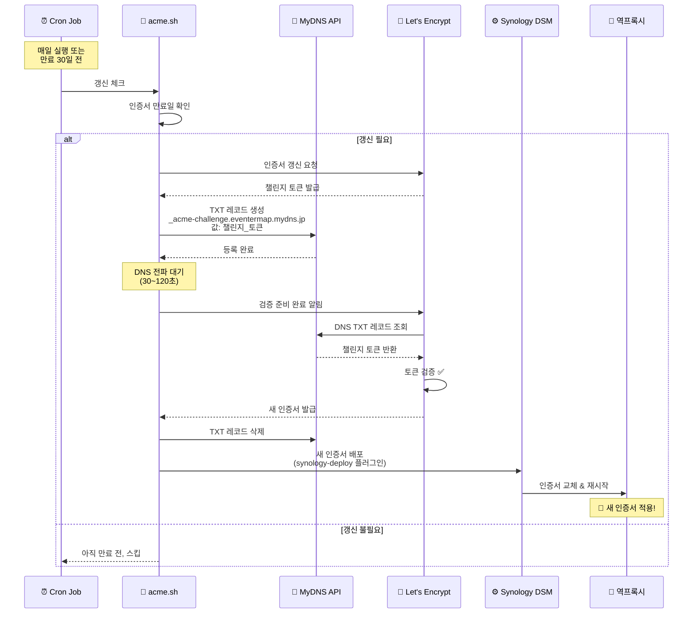

# 네트워크 아키텍처 및 인증서 갱신

IPv6Plus 환경에서의 eventer-map 네트워크 구조와 Let's Encrypt 인증서 갱신 메커니즘을 설명합니다.

---

## 📋 목차

- [전체 네트워크 구조](#전체-네트워크-구조)
- [IPv6Plus 환경의 특징](#ipv6plus-환경의-특징)
- [일반적인 접속 흐름](#일반적인-접속-흐름)
- [인증서 발급/갱신 방식](#인증서-발급갱신-방식)
- [DNS-01 Challenge 상세 흐름](#dns-01-challenge-상세-흐름)

---

## 전체 네트워크 구조 (실제 구성)



---

## IPv6Plus 환경의 특징

### ⚠️ IPv4 포트 제한 (MAP-E)

일본의 많은 ISP가 제공하는 IPv6Plus (IPv6 IPoE + IPv4 over IPv6) 환경에서는:

| 항목 | 설명 |
|-----|------|
| **사용 가능 IPv4 포트** | 한정된 포트 범위만 할당 (예: 10000~20000 범위의 일부) |
| **사용 불가 포트** | ❌ **80, 443, 25 등 웰노운 포트** (IPv4만) |
| **IPv6** | ✅ **모든 포트 사용 가능** (제한 없음!) |
| **공인 IP** | IPv4는 여러 가구와 공유, IPv6는 전용 글로벌 주소 |

### 🎯 해결책: IPv6 직접 연결

> [!IMPORTANT]
> **IPv4의 포트 80, 443 제한은 IPv6에는 적용되지 않습니다!**
> 
> - ✅ IPv6를 통한 포트 80, 443 직접 접속 가능
> - ✅ NAT 없이 NAS가 직접 인터넷에 연결
> - ⛔ 포트 포워딩 불필요

### 📡 IPv6 주소 할당 방식

#### IPv4 vs IPv6 비교

| 항목 | IPv4 (NAT) | IPv6 (IPv6Plus) |
|------|-----------|-----------------|
| **주소 할당** | 라우터 1개만 공인 IP | **모든 기기가 각각 공인 IPv6** |
| **주소 개수** | 1개 (공유) | /64 프리픽스 (2^64개 ≈ 18경 개) |
| **NAT** | ✅ 필요 | ⛔ 없음 (직접 연결) |
| **포트 포워딩** | ✅ 필요 | ⛔ 불필요 |
| **보안** | NAT가 간접적 방화벽 역할 | **기기별 방화벽 필수!** |

#### IPv6Plus 환경의 주소 할당

```
ISP (IPv6 IPoE)
  ↓
라우터에 /64 또는 /56 프리픽스 할당
  예: 2001:0db8:1234:5678::/64
  ↓
각 기기가 고유한 글로벌 IPv6 주소 자동 생성
  ├─ PC:        2001:0db8:1234:5678:abcd:1234:5678:0001
  ├─ 스마트폰:   2001:0db8:1234:5678:abcd:1234:5678:0002
  ├─ NAS:       2001:0db8:1234:5678:abcd:1234:5678:0003  ← eventermap.mydns.jp
  └─ IoT 기기:  2001:0db8:1234:5678:abcd:1234:5678:0004
```

**핵심 차이점**:
- IPv4: 라우터만 공인 IP → 내부 기기는 192.168.x.x (사설 IP)
- **IPv6: 모든 기기가 직접 인터넷에 노출되는 공인 IPv6 주소**

#### IPv6 주소의 동적 특성

> [!IMPORTANT]
> **IPv6 주소도 변경됩니다!**
> 
> 공인 IPv6 주소를 받는다고 해서 고정 IP는 아닙니다.

**IPv6 주소가 변경되는 경우**:

| 상황 | 설명 | 변경 주기 |
|------|------|----------|
| **프리픽스 변경** | ISP가 라우터에 할당하는 /64 프리픽스가 변경됨 | 재연결 시, 정기적 |
| **Privacy Extensions** | 보안을 위해 인터페이스 ID를 주기적으로 변경 (RFC 4941) | 24시간~1주일 |
| **DHCP 갱신** | DHCPv6로 받은 주소의 임대 기간 만료 | 설정에 따라 |
| **라우터 재시작** | 라우터가 재시작되면 새 주소 할당 | 재시작 시 |

**예시**:
```
# 오늘
NAS IPv6: 2001:0db8:1234:5678:abcd:1234:5678:0003

# 1주일 후 (프리픽스 변경)
NAS IPv6: 2001:0db8:9abc:def0:abcd:1234:5678:0003
          ^^^^^^^^^^^^^^^^  ← 이 부분이 변경됨!
```

**그래서 MyDNS IP 업데이트가 필요합니다!**
- IPv6 주소가 변경되면 → MyDNS에 새 주소 등록
- 24시간마다 자동 업데이트로 최신 상태 유지

> [!IMPORTANT]
> **IPv6 전용 설정**
> 
> eventer-map은 IPv6Plus 환경에서 포트 443을 사용하기 위해 **IPv6 전용**으로 설정되어 있습니다.
> - MyDNS에 **IPv6(AAAA) 레코드만** 등록 (`ipv6.mydns.jp` 사용)
> - IPv4(A) 레코드는 등록하지 않음
> - 외부 클라이언트가 IPv6로만 접속하도록 강제
> - IPv4 포트 443 제한 문제 우회

> [!WARNING]
> **보안 주의!**
> - IPv6 환경에서는 NAS가 직접 인터넷에 노출됩니다
> - NAT의 간접적인 보호가 없으므로 **방화벽 설정이 필수**입니다
> - 불필요한 포트는 모두 차단하고, 필요한 포트만 허용하세요

---

## 일반적인 접속 흐름 (실제 구성)

### 사용자 웹사이트 접속 시퀀스



> [!NOTE]
> **Frontend 컨테이너의 Nginx**가 `/api/*` 요청을 Backend 컨테이너로 프록시합니다.

---

## 인증서 발급/갱신 방식

Let's Encrypt는 두 가지 인증 방식을 제공합니다:

### ✅ HTTP-01 Challenge (현재 사용 중!)



**작동 이유**: IPv6를 통해 포트 80에 직접 접근 가능하므로, HTTP-01 Challenge가 정상 작동합니다.

> [!NOTE]
> **DSM은 NAS의 운영체제**입니다. Synology NAS 하드웨어에서 실행되는 소프트웨어로, 인증서 관리 기능을 포함합니다.

---

### 🔄 DNS-01 Challenge (대안)



**핵심**: DNS API를 통해 도메인 소유권을 증명하므로, **웹서버나 포트 80이 전혀 필요 없습니다!**

---

## DNS-01 Challenge 상세 흐름

### 1️⃣ 인증서 발급/갱신 프로세스



---

## 🎯 핵심 포인트 (eventer-map 구성)

### 1. **IPv6 직접 연결로 표준 포트 사용**

현재 구성:
- ✅ **IPv6를 통해 포트 443으로 직접 접속**
- ✅ **포트 포워딩 불필요** (NAT 없음)
- ✅ **표준 HTTPS URL**: `https://eventermap.mydns.jp`

### 2. **인증서 자동 갱신은 HTTP-01로 해결**

- ✅ **HTTP-01 Challenge**: IPv6를 통해 포트 80 접근 가능
- ✅ **Synology DSM 자동 갱신**: 만료 30일 전 자동 처리
- ⛔ DNS-01 불필요 (HTTP-01이 정상 작동)

### 3. **2단계 프록시 구조**

- **1단계 (Synology 역프록시)**: 외부 HTTPS 443 → Frontend 7772 (SSL 터미네이션)
- **2단계 (Frontend Nginx)**: 정적 파일 직접 서빙, API 요청(`/api/*`)은 Backend 7773으로 프록시
- **Backend**: Docker 네트워크 내부에서만 접근 가능 (외부 직접 노출 안 됨)

### 4. **보안: NAS 방화벽이 최전선**

- IPv6는 NAS를 직접 노출하므로 방화벽 설정이 매우 중요
- 필요한 포트(80, 443, 5001)만 허용
- SSH, 관리 포트는 특정 IP만 허용 권장

---

## 🔧 실제 구성 (eventer-map)

### ✅ 현재 구성: IPv6 직접 접속

**사용 중인 방식**: IPv6 글로벌 주소를 통한 직접 연결

| 구성 요소 | 설정 값 |
|----------|---------|
| **도메인** | eventermap.mydns.jp |
| **DNS 레코드** | A (IPv4) + AAAA (IPv6) |
| **MyDNS 업데이트** | 24시간마다 자동 |
| **포트 포워딩** | ⛔ 불필요 (IPv6 직접 연결) |
| **NAS 방화벽** | 포트 80, 443 허용 |
| **역방향 프록시** | 443 → 7772 (Frontend) |
| **컨테이너 포트** | Frontend: 7772:80<br/>Backend: 7773:8000 |
| **SSL/TLS** | Let's Encrypt (HTTP-01, 자동 갱신) |

**외부 접속 URL**: `https://eventermap.mydns.jp` (표준 포트 443)

### 포트 매핑 상세

```
외부 접속                          NAS                        Docker 컨테이너
──────────────────────────────────────────────────────────────────────────────
                                  방화벽      Synology        Frontend        Backend
                                             역프록시         Nginx
                                             
https://eventermap.mydns.jp       :443  →    :443     →     :7772    →  :80
(IPv6, HTTPS)                                  ↓             (Nginx)
                                             SSL 종료
                                             
정적 파일 (/, /static/*)                                      
  └─→ React 앱 서빙 ──────────────────────────────────────→  Nginx가 직접 응답
  
API 요청 (/api/*)                                             
  └─→ 내부 프록시 ────────────────────────────────────→  :7773   →  :8000
                                                        (Docker 네트워크)  (FastAPI)
```

| 레이어 | 프로토콜/포트 | 설명 |
|--------|-------------|------|
| **사용자** | HTTPS :443 | 표준 HTTPS 포트 (IPv6) |
| **NAS 방화벽** | :443 허용 | IPv6 패킷 통과 |
| **Synology 역프록시** | :443 → :7772 | SSL 터미네이션, Frontend로 전달 |
| **Frontend 컨테이너** | 7772:80 | Nginx (React 앱 + API 프록시) |
| └ 정적 파일 | - | Nginx가 직접 서빙 |
| └ API 요청 (`/api/*`) | → :7773 | Backend로 내부 프록시 |
| **Backend 컨테이너** | 7773:8000 | FastAPI (API 서버) |

> [!IMPORTANT]
> **Synology 역프록시**는 Frontend 컨테이너만 연결합니다.  
> **Frontend의 Nginx**가 `/api/*` 요청을 Backend로 프록시합니다.

---

### 기타 시나리오 참고

### Scenario B: IPv6 직접 접속 (포트 포워딩 불필요)

**적용 대상**: NAS가 IPv6 주소를 가지고 있고, 라우터가 IPv6 패킷을 그대로 전달

| 설정 | 내용 |
|-----|------|
| **MyDNS 설정** | IPv6 주소 등록 (AAAA 레코드) |
| **NAS 방화벽** | 포트 443, 80 허용 |
| **라우터 설정** | IPv6 패스스루 활성화 (기본값) |
| **포트 포워딩** | ⛔ 불필요 |

**접속 URL**: `https://eventermap.mydns.jp` (표준 포트)

> [!NOTE]
> IPv6는 NAT가 없으므로 **NAS가 직접 인터넷에 노출**됩니다.  
> 반드시 **NAS 방화벽 설정**을 철저히 해야 합니다!

---

### Scenario C: 로컬 네트워크만 사용

**적용 대상**: 외부 접속 없이 내부에서만 사용

| 설정 | 내용 |
|-----|------|
| **포트 포워딩** | ⛔ 불필요 |
| **MyDNS** | IP 업데이트만 유지 (선택사항) |
| **접속** | NAS IP로 직접 접속 |

**접속 URL**: `http://192.168.x.x:65104` (NAS 내부 IP)

---

### Scenario D: Synology QuickConnect / Cloudflare Tunnel

**적용 대상**: 포트 포워딩 없이 외부 접속을 원할 때

- **QuickConnect**: Synology 중계 서버 사용
- **Cloudflare Tunnel**: Cloudflare가 터널 제공
- **Tailscale/ZeroTier**: VPN 기반 접속

**장점**: 포트 포워딩 불필요, Let's Encrypt 자동 처리  
**단점**: 속도 제한, 외부 서비스 의존

---

## 🤔 현재 구성 확인

### 질문 1: 외부에서 접속이 가능한가요?

- ✅ **가능** → IPv6 직접 접속 또는 QuickConnect 사용 중
- ❌ **불가능** → 로컬 네트워크만 사용 중

### 질문 2: 어떤 URL로 접속하고 있나요?

```bash
# 예시
https://eventermap.mydns.jp          # IPv6 또는 QuickConnect
http://192.168.1.100:65104           # 로컬 네트워크
https://eventermap.mydns.jp:8443     # 포트 포워딩
```

---

## 📚 관련 문서

- [배포 가이드](./DEPLOYMENT_GUIDE.md)
- [MyDNS 설정](./MYDNS_SETUP.md)
- [SSL 설정 스크립트](../../scripts/setup_ssl.sh)

---

## ❓ FAQ

### Q1: 왜 MyDNS IP 업데이트는 작동하는데 포트 80은 안 되나요?

**A**: IP 업데이트는 **NAS에서 MyDNS API로 요청**을 보내는 것이고 (아웃바운드), 인증서 발급은 **Let's Encrypt가 NAS로 접속**하는 것입니다 (인바운드). 포트 80 제한은 인바운드 연결에만 영향을 줍니다.

### Q2: DNS-01을 사용하면 자동 갱신도 포트 80 없이 가능한가요?

**A**: ✅ 네! DNS-01 방식은 갱신할 때도 DNS API만 사용하므로 포트 80/443이 전혀 필요 없습니다.

### Q3: 시놀로지 DSM 기본 Let's Encrypt는 어떻게 작동하나요?

**A**: DSM은 기본적으로 **HTTP-01**을 사용하므로, IPv6Plus 환경에서는 자동 갱신이 실패할 수 있습니다. 이 경우 **acme.sh + DNS-01**로 전환하는 것이 권장됩니다.

### Q4: 그럼 acme.sh 설정이 필요한가요?

**A**: 현재 상황에 따라 다릅니다:
- DSM Let's Encrypt가 **정상 작동 중**이면 → 유지 가능
- 갱신 실패 또는 **포트 80 포워딩 불가**하면 → acme.sh + DNS-01 권장

### Q5: IPv6 전용으로 설정하면 IPv4에서 접속 못 하나요?

**A**: 네, IPv4 전용 네트워크에서는 접속할 수 없습니다. 하지만:
- ✅ 대부분의 최신 환경(스마트폰 LTE/5G, 최신 ISP)은 IPv6 지원
- ✅ IPv6Plus 환경에서 IPv4 포트 443은 어차피 차단되어 사용 불가
- ⚠️ 일부 구형 모바일 네트워크나 IPv4 전용 환경에서는 접속 불가

**확인 방법**: 스마트폰에서 `https://eventermap.mydns.jp` 접속 시도
