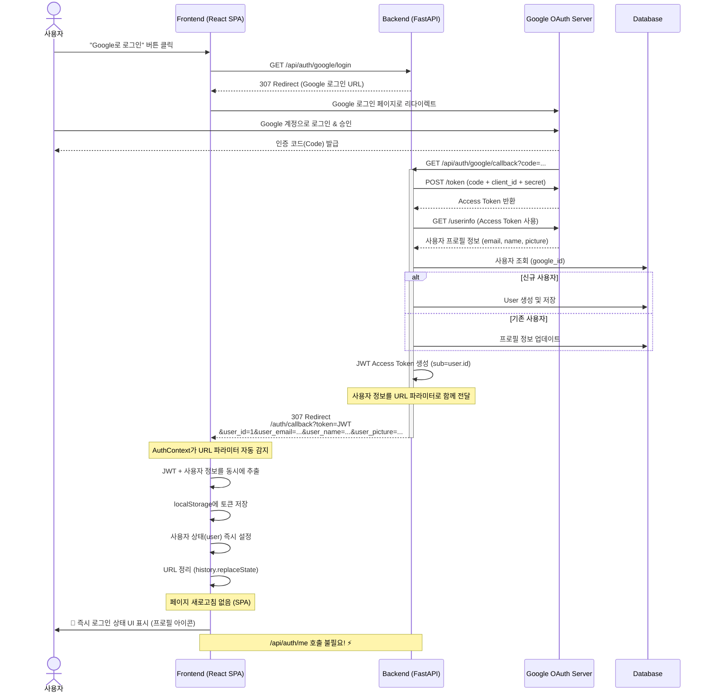

# Google OAuth 로그인 시퀀스 (최적화됨)

이 문서는 Eventer Map 애플리케이션의 Google OAuth 2.0 로그인 프로세스를 설명합니다.

> **최종 업데이트**: 2025-12-22  
> **최적화 내용**: SPA 방식 + 사용자 정보 즉시 전달로 로그인 속도 개선

---

## 최적화된 인증 플로우



---

## 주요 개선 사항

### 1. **SPA(Single Page Application) 방식 채택**

**이전:**
- `/auth/callback` 경로에 별도 `AuthCallback.tsx` 컴포넌트
- `window.location.replace('/')`로 페이지 새로고침
- 모바일에서 localStorage 저장 타이밍 이슈로 `setTimeout(500ms)` 필요

**현재:**
- `AuthContext`가 URL 파라미터를 직접 감지하여 처리
- `window.history.replaceState()`로 URL만 정리 (페이지는 그대로)
- `AuthCallback.tsx` 컴포넌트 제거
- 페이지 새로고침 없음 → localStorage 안정성 구조적 보장

### 2. **사용자 정보 즉시 전달**

**이전:**
```
Backend → Frontend: ?token=JWT
Frontend → Backend: GET /api/auth/me (2~5초 소요)
Backend → Frontend: 사용자 정보 응답
Frontend: UI 갱신
```

**현재:**
```
Backend → Frontend: ?token=JWT&user_id=1&user_email=...&user_name=...
Frontend: 즉시 UI 갱신 ⚡ (/api/auth/me 호출 불필요)
```

**효과:**
- 로그인 후 UI 갱신 시간: **2~5초 → 즉시**
- 네트워크 요청 1회 절감
- 모바일 환경에서 특히 체감 개선

### 3. **로딩 UX 개선**

**추가된 기능:**
- 인증 중일 때 회전하는 스피너 + "로그인 중..." 메시지 표시
- 사용자에게 명확한 피드백 제공

---

## 주요 구성 요소

### Frontend

#### **AuthContext** (`frontend/src/context/AuthContext.tsx`)
- **OAuth 콜백 자동 감지**: `useEffect`에서 URL의 `?token=` 파라미터 감지
- **즉시 상태 설정**: URL에서 추출한 사용자 정보로 `user` 상태 즉시 설정
- **Fallback 로직**: 사용자 정보가 없으면 기존 방식대로 `/api/auth/me` 호출 (하위 호환성)
- **중복 처리 방지**: `sessionStorage`로 OAuth 콜백 중복 처리 차단

**핵심 로직:**
```typescript
// OAuth 콜백 처리
useEffect(() => {
    const params = new URLSearchParams(window.location.search);
    const token = params.get('token');
    
    if (token) {
        // 토큰 저장
        localStorage.setItem('auth_token', token);
        setToken(token);
        
        // 사용자 정보 추출
        const userId = params.get('user_id');
        const userEmail = params.get('user_email');
        
        if (userId && userEmail) {
            // 즉시 사용자 설정 (API 호출 불필요!)
            setUser({ id: parseInt(userId), email: userEmail, ... });
            setIsLoading(false);
        }
        
        // URL 정리 (페이지는 그대로)
        window.history.replaceState({}, '', window.location.pathname);
    }
}, []);
```

#### **App.tsx**
- **로딩 상태 표시**: `isLoading` 상태일 때 스피너 표시
- `AuthCallback` 컴포넌트 제거 (더 이상 불필요)

#### **LoginButton**
- `/api/auth/google/login`으로 리다이렉트

---

### Backend

#### **Login Endpoint** (`/api/auth/google/login`)
- Google OAuth URL 생성 및 리다이렉트
- CSRF 방지용 `state` 값을 쿠키에 저장

#### **Callback Endpoint** (`/api/auth/google/callback`)
1. 인증 코드 검증 및 토큰 교환
2. Google에서 사용자 정보 가져오기
3. DB에 사용자 정보 동기화 (Create or Update)
4. 자체 JWT 발급 (HS256)
5. **⭐ NEW**: 사용자 정보를 URL 파라미터로 함께 전달

**핵심 코드:**
```python
# backend/routes/auth.py
from urllib.parse import urlencode

user_params = {
    'token': jwt_token,
    'user_id': user.id,
    'user_email': user.email,
    'user_name': user.name or '',
    'user_picture': user.profile_image or ''
}

response = RedirectResponse(
    url=f"{FRONTEND_URL}/auth/callback?{urlencode(user_params)}"
)
```

#### **Token Verification**
- `python-jose`를 사용하여 JWT 서명 및 만료 검증
- `/api/auth/me` 엔드포인트 (Fallback용으로 유지)

---

## 보안 고려사항

### URL에 사용자 정보 노출
- **전달되는 정보**: ID, 이메일, 이름, 프로필 이미지 (공개 정보)
- **민감 정보 제외**: 비밀번호, Google ID 등은 전달하지 않음
- **토큰 보안**: JWT는 여전히 서명되어 있으며, 만료 시간 설정됨
- **HTTPS 권장**: 프로덕션 환경에서는 HTTPS 사용 필수

### CSRF 방어
- OAuth `state` 파라미터로 CSRF 공격 방지
- 백엔드에서 `state` 쿠키와 비교하여 검증

---

## 성능 비교

| 항목 | 이전 | 현재 |
|------|------|------|
| **로그인 후 UI 갱신** | 2~5초 | **즉시** ⚡ |
| **네트워크 요청** | 2회 (토큰 교환 + /auth/me) | **1회** (토큰 교환만) |
| **페이지 새로고침** | ✓ (window.location.replace) | ✗ (SPA) |
| **모바일 안정성** | setTimeout 의존 | 구조적 보장 |
| **사용자 피드백** | 없음 | 로딩 스피너 |

---

## Fallback 동작

사용자 정보가 URL에 포함되지 않은 경우 (예: 백엔드 구버전 호환):

1. 토큰만 추출하여 저장
2. 기존 방식대로 `/api/auth/me` API 호출
3. 정상적으로 로그인 처리

→ **하위 호환성 보장**

---

## 관련 파일

### Frontend
- [`frontend/src/context/AuthContext.tsx`](../../frontend/src/context/AuthContext.tsx) - 핵심 인증 로직
- [`frontend/src/App.tsx`](../../frontend/src/App.tsx) - 로딩 UI
- [`frontend/src/App.css`](../../frontend/src/App.css) - 스피너 애니메이션

### Backend
- [`backend/routes/auth.py`](../../backend/routes/auth.py) - OAuth 엔드포인트
- [`backend/utils/auth.py`](../../backend/utils/auth.py) - JWT 생성/검증

---

## 트러블슈팅

### 로그인 후 로그아웃 상태로 돌아감
- **원인**: URL 파라미터 파싱 실패 또는 백엔드가 사용자 정보를 전달하지 않음
- **해결**: 브라우저 콘솔에서 로그 확인 ("OAuth 로그인 성공 (즉시 모드)" 또는 "기존 모드")

### 무한 리다이렉트
- **원인**: `sessionStorage`의 `oauth_processed` 플래그 문제
- **해결**: 브라우저 개발자 도구에서 세션 스토리지 초기화

### 로딩 스피너가 계속 표시됨
- **원인**: `isLoading` 상태가 `false`로 설정되지 않음
- **해결**: `AuthContext`의 `setIsLoading(false)` 호출 확인

---

## 참고 문서
- [Google OAuth 2.0 설정 가이드](../setup/GOOGLE_OAUTH_SETUP.md)
- [환경 변수 설정](../setup/ENVIRONMENT_VARIABLES.md)
- [개발 환경 설정](../setup/DEVELOPMENT.md)
