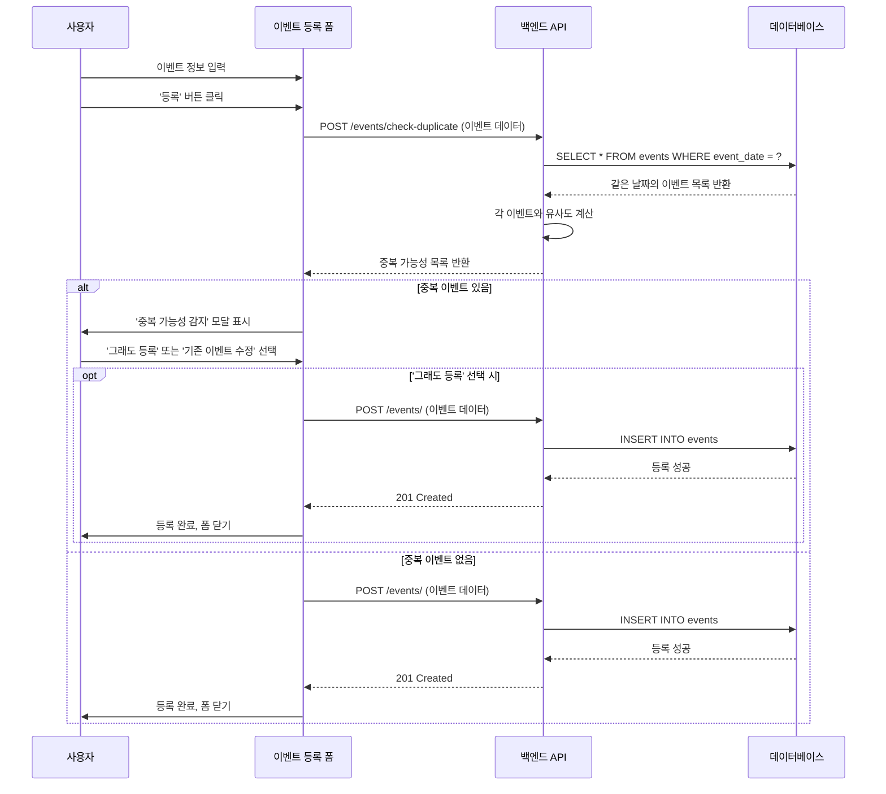

# 이벤트 중복 검사 시스템 설계

> 📅 **최종 수정일**: 2025-11-28
> 🎯 **목적**: 같은 이벤트의 중복 등록 방지

---

## 배경

사용자가 실수로 같은 이벤트를 여러 번 등록하거나, 표기가 다른 동일 이벤트를 등록하는 것을 방지하기 위한 시스템입니다.

### 해결해야 할 문제

1. **같은 건물, 다른 홀**: 도쿄돔 Hall A와 Hall B에서 동시에 다른 공연이 있을 수 있음
2. **표기 차이**: "YOASOBI Live" vs "ヨアソビライブ" (출연자 정규화 시스템으로 대응)
3. **시간 차이**: 개장 시간과 개연 시간이 다를 수 있음
4. **데이터 정확성**: 장소명 텍스트보다 Google API의 위도/경도가 더 정확

---

## 설계 원칙

### 1. 5가지 기준 종합 판단

단순히 날짜/장소/시간만으로는 부족하므로, **출연자**와 **제목** 유사도를 추가합니다.

| 기준 | 가중치 | 이유 |
|------|--------|------|
| 날짜 일치 | 25% | 다른 날이면 확실히 다른 이벤트 |
| 거리 (≤50m) | 20% | 위도/경도 기반, 정확한 장소 판별 |
| 시간 겹침 (±30분) | 15% | 시간대 유사성 |
| **출연자 유사도** | **25%** | 가장 명확한 구분 기준 |
| **제목 유사도** | **15%** | 보조 판별 기준 |

### 2. 라이브러리 활용

- **geopy**: 좌표 간 거리 계산 (검증된 Haversine 공식)
- **difflib**: 텍스트 유사도 계산 (Python 표준 라이브러리)

### 3. 사용자 선택권 제공

완전 자동 차단이 아닌, 경고 후 사용자가 최종 결정합니다.

---

## 구현 상세

### 유사도 계산 알고리즘

```python
def calculate_event_similarity(event1: Event, event2: Event) -> dict:
    """
    이벤트 간 종합 유사도 계산
    """
    from geopy.distance import geodesic
    from difflib import SequenceMatcher
    
    # 1. 날짜 (25%)
    same_date = event1.event_date == event2.event_date
    date_score = 1.0 if same_date else 0.0
    
    # 2. 거리 (20%)
    distance = calculate_distance(
        event1.latitude, event1.longitude,
        event2.latitude, event2.longitude
    )
    # 0m = 1.0, 50m = 0.5, 100m+ = 0.0
    location_score = max(0, 1 - (distance / 100)) if distance <= 100 else 0.0
    
    # 3. 시간 (15%)
    time_diff = calculate_time_difference(event1.start_time, event2.start_time)
    # 0분 = 1.0, 30분 = 0.5, 60분+ = 0.0
    time_score = max(0, 1 - (abs(time_diff) / 60)) if abs(time_diff) <= 60 else 0.0
    
    # 4. 출연자 (25%)
    performer_score = calculate_performer_similarity(event1, event2)
    
    # 5. 제목 (15%)
    title_score = calculate_text_similarity(event1.title, event2.title)
    
    # 가중 합계
    total_score = (
        date_score * 0.25 +
        location_score * 0.20 +
        time_score * 0.15 +
        performer_score * 0.25 +
        title_score * 0.15
    )
    
    # 중복 판정 (엄격한 기준)
    is_duplicate = (
        same_date and 
        distance <= 50 and 
        abs(time_diff) <= 30 and
        (performer_score >= 0.8 or title_score >= 0.8)
    )
    
    # 추천
    if is_duplicate:
        recommendation = "duplicate"      # 중복 가능성 매우 높음
    elif total_score >= 0.7:
        recommendation = "similar"        # 유사함, 주의 필요
    elif total_score >= 0.4:
        recommendation = "maybe"         # 애매함, 사용자 확인
    else:
        recommendation = "different"     # 다른 이벤트
    
    return {
        "is_duplicate": is_duplicate,
        "similarity_score": round(total_score, 2),
        "matched_criteria": {
            "same_date": same_date,
            "same_location": distance <= 50,
            "same_time": abs(time_diff) <= 30,
            "distance_meters": round(distance, 1) if distance != float('inf') else None,
            "time_diff_minutes": time_diff if time_diff != 999 else None,
            "performer_similarity": round(performer_score, 2),
            "title_similarity": round(title_score, 2)
        },
        "recommendation": recommendation
    }
```

### 출연자 유사도 계산 (수정됨)

```python
def calculate_performer_similarity(event1: models.Event, event2: models.Event) -> float:
    """
    출연자 리스트 간 유사도 계산 (Jaccard 유사도)
    
    Args:
        event1, event2: 비교할 이벤트 객체
        
    Returns:
        float: 출연자 유사도 (0.0 ~ 1.0)
    """
    # 출연자 이름 세트 (정규화된 이름 사용)
    performers1 = set(p.normalized_name for p in event1.performers_rel)
    performers2 = set(p.normalized_name for p in event2.performers_rel)
    
    if not performers1 or not performers2:
        return 0.0
    
    # Jaccard 유사도 (교집합 / 합집합)
    intersection = len(performers1 & performers2)
    union = len(performers1 | performers2)
    
    return intersection / union if union > 0 else 0.0
```

**설명**:
- 기존의 '최대 텍스트 유사도' 계산 로직은 1명만 겹쳐도 100%가 나오는 문제가 있어 제거했습니다.
- 이제 두 출연자 그룹 전체를 비교하는 **자카드 유사도**만 사용하여 그룹 간의 유사도를 더 정확하게 측정합니다.
- 출연자 이름의 다른 표기법(예: `YOASOBI` vs `ヨアソビ`) 문제는 출연자 등록 시 `normalized_name`을 생성하는 정규화 단계에서 처리합니다.

**예시**:
- `["A"]` vs `["A"]` → 1.0 (1/1)
- `["A"]` vs `["B"]` → 0.0 (0/2)
- `["A", "B"]` vs `["A"]` → 0.5 (1/2)
- `["A", "B"]` vs `["A", "B", "C"]` → 0.67 (2/3)

---

## API 설계

### POST /events/check-duplicate

**요청**:
```json
{
  "title": "YOASOBI Live Tour 2025",
  "event_date": "2025-12-15",
  "start_time": "18:00",
  "latitude": 35.7056,
  "longitude": 139.7519,
  "performers": "YOASOBI"
}
```

**응답**:
```json
{
  "duplicates": [
    {
      "event_id": 123,
      "event_title": "YOASOBI 공연",
      "event_date": "2025-12-15",
      "location": "도쿄돔",
      "start_time": "18:00",
      "performers": ["YOASOBI"],
      "similarity_score": 0.95,
      "is_duplicate": true,
      "matched_criteria": {
        "same_date": true,
        "same_location": true,
        "same_time": true,
        "distance_meters": 15.2,
        "time_diff_minutes": 0,
        "performer_similarity": 1.0,
        "title_similarity": 0.7
      },
      "recommendation": "duplicate"
    }
  ]
}
```

---

## UI 흐름 (시퀀스 다이어그램)



---

## 성능 고려사항

### 최적화 전략

1. **검색 범위 제한**: 같은 날짜의 이벤트만 비교 (DB 인덱스 활용)
2. **API 호출 시점**: 프론트엔드에서 제출(submit) 시에만 API 호출
3. **캐싱**: 출연자 정규화 이름은 DB에 사전 저장됨

### 데이터베이스 인덱스

```sql
CREATE INDEX idx_event_date ON events(event_date);
```

---

## 의존성

### 백엔드

```txt
geopy>=2.4.0  # 좌표 거리 계산
```

---

## 향후 개선 아이디어

1. **머신러닝 적용**: 사용자의 중복 판정 패턴 학습
2. **자동 병합**: 완전 중복 시 자동으로 정보 병합 제안
3. **이력 추적**: 중복 검사 결과 로그 저장 및 분석
4. **알림 설정**: 중복 등록 시도 시 이메일 알림
