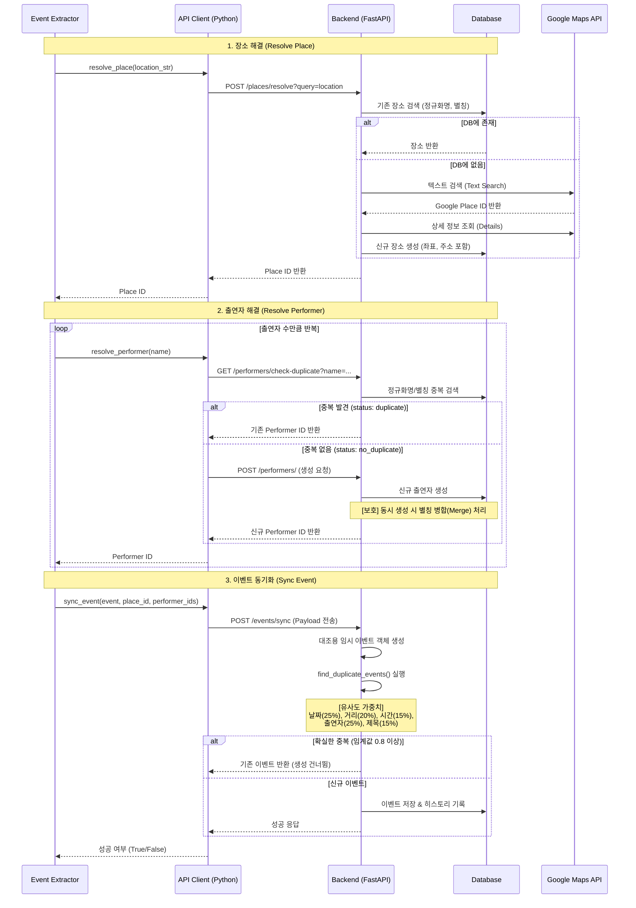

# 📊 이벤트 동기화 로직 상세 분석 보고서

본 보고서는 [event-extractor/main.py](file:///workspace/eventer-map/event-extractor/main.py)의 이벤트 루프에서 실행되는 **장소 해결(Resolve Place)**, **출연자 해결(Resolve Performer)**, **이벤트 동기화(Sync Event)** 과정과 연동되는 백엔드 API의 내부 작동 원리를 분석한 내용입니다.

---

## 🔄 전체 흐름도 (Workflow)

---

## 🔍 상세 분석

### 📍 A. 장소 해결 ([resolve_place](file:///workspace/eventer-map/backend/routes/places.py#17-91))
**추출된 텍스트 기반 장소명을 공간 데이터(위도/경도, 주소)로 변환하고 ID를 획득하는 단계**입니다.

1. **내부 호출**: `POST {Backend}/places/resolve`
2. **백엔드 처리 ([places.py](file:///workspace/eventer-map/backend/routes/places.py))**:
   * **1단계 (DB 검색)**: 문자열 정규화(`normalize_text`) 후 정규화명(`normalized_name`) 및 별칭(`aliases`)에서 일치하는 장소가 있는지 확인합니다. 찾으면 즉시 반환합니다.
   * **2단계 (Google Maps 연동)**: DB에 없을 경우 Google Maps Text Search API를 호출하여 `google_place_id`를 획득합니다.
     * 획득 후에도 DB 중복을 한 번 더 체크합니다.
     * 상세 정보를 조회하여 **정식 명칭, 주소, 위도/경도**를 매핑하고 DB에 영구 저장합니다. (사용자가 검색했던 텍스트는 `aliases`에 기록됨)
   * **3단계 (Fallback)**: API 검색도 실패하면 좌표/주소 없이 이름만 가진 레거시 행태로 백업 생성합니다.

---

### 🎤 B. 출연자 해결 ([resolve_performer](file:///workspace/eventer-map/event-extractor/services/api_client.py#57-103))
**이벤트에 참석하는 아티스트/출연자를 식별하고 고유 ID를 획득하는 단계**입니다.

1. **내부 호출**:
   * `GET {Backend}/performers/check-duplicate` (중복 체크)
   * `POST {Backend}/performers/` (생성 시)
2. **백엔드 처리 ([performers.py](file:///workspace/eventer-map/backend/routes/performers.py))**:
   * **중복 체크**: 정규화명 일치(`exact_match`) 시 [duplicate](file:///workspace/eventer-map/backend/utils/event_duplicate.py#290-325) 상태를 반환하고, 별칭(`aliases` JSON Like 검색) 일치 시 `similar_found`를 반환합니다.
   * **생성 및 경쟁 조건(Race Condition) 처리**:
     * 생성 요청 시 이미 존재하는 정규화명이 있다면 `409 Conflict`를 발생시키고, [APIClient](file:///workspace/eventer-map/event-extractor/services/api_client.py#22-134)는 여기서 ID를 추출합니다.
     * 만약 DB 유니크 제약 충돌(`IntegrityError`)이 발생하면, 백엔드는 에러를 뱉는 대신 **기존 출연자 항목에 새 별칭을 병합(Merge)**하여 안전하게 업데이트 시도(`JSONResponse(200, status="merged")`) 합니다.

---

### 📅 C. 이벤트 동기화 ([sync_event](file:///workspace/eventer-map/event-extractor/services/api_client.py#104-134))
**최종적으로 해결된 `place_id`와 `performer_ids`를 조합하여 이벤트를 등록하되, 동일/유사 이벤트를 완벽하게 차단하는 핵심 단계**입니다.

1. **내부 호출**: `POST {Backend}/events/sync`
2. **백엔드 처리 ([events.py](file:///workspace/eventer-map/backend/routes/events.py) & [event_duplicate.py](file:///workspace/eventer-map/backend/utils/event_duplicate.py))**:
   * **중복 검사 ([find_duplicate_events](file:///workspace/eventer-map/backend/utils/event_duplicate.py#240-288))**:
     * 동일 날짜(`event_date`)의 기존 이벤트 목록을 조회합니다.
     * 각 항목과 가중치 기반 **유사도(Similarity Score)**를 계산합니다.
       * 📅 **날짜** (25%): 일치 여부
       * 📍 **거리** (20%): 두 장소 간 하버사인(Haversine) 거리 (50m 이내 0.5 이상 점수 부여)
       * ⏰ **시간** (15%): `door_time`, `start_time`, `end_time` 격차가 30분 이내인지
       * 🎤 **출연자** (25%): 자카드(Jaccard) 유사도 (교집합/합집합)
       * 📝 **제목** (15%): 문자열 SequenceMatcher 비율
   * **결정**:
     * 종합 유사도 점수가 **0.8(80%) 이상**이거나 확정적 중복([is_duplicate](file:///workspace/eventer-map/backend/utils/event_duplicate.py#290-325)) 플래그가 활성화된 경우, **데이터 삽입을 건너뛰고 기존 이벤트를 반환**합니다.
     * 중복이 아니라면 DB에 저장하고 **수정 이력(Event History)**을 생성한 뒤 완료합니다.

---

> [!TIP]
> **설계적 특징**:
> - 오발송/과다 호출을 막기 위해 **자체 중복 데이터 식별(Deduplication)** 로직이 클라이언트가 아닌 **백엔드 엔드포인트 내부에 탑재**되어 있습니다.
> - Google Maps 비용 절감 및 속도 향상을 위해 DB 별칭(Alias) 캐싱을 적극 활용합니다.
